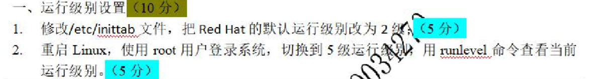
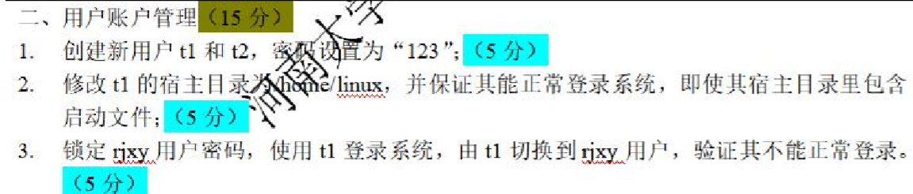
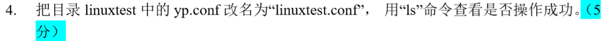
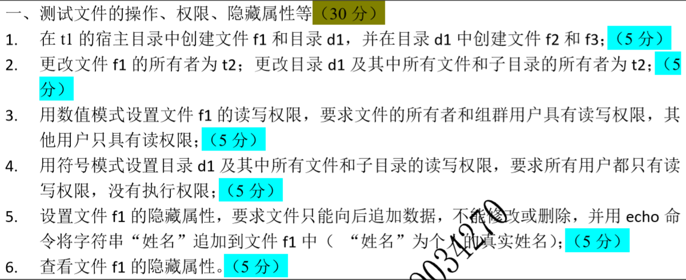
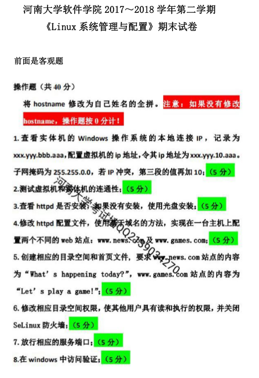
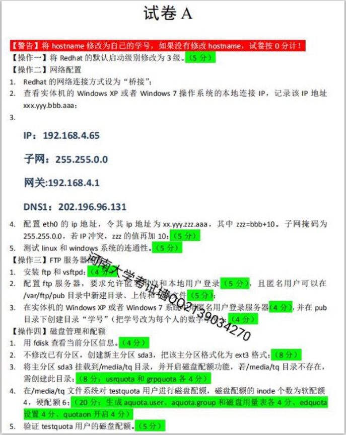
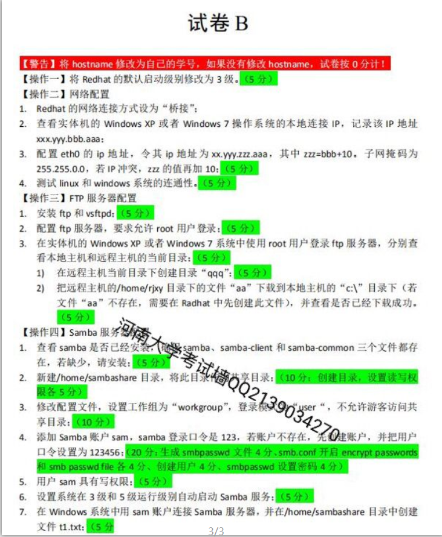
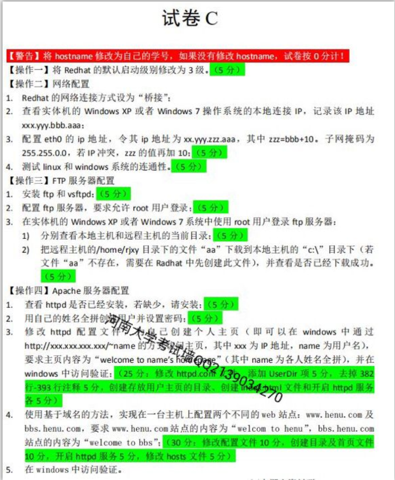

# 课程安排

> 期中，期末考试

---

## 课程方向

```
1. shell脚本
---			期中
2. 网络
---			期末
```

> 课程所需虚拟机软件

```
https://pan.baidu.com/s/1EteT5PEZPku6G3Cy8KAm6w&shfl=sharepset
```

> 若想直接用虚拟机文件，则可以参照我的链接

```c
# 2019年10月24日更新
百度网盘链接：
https://pan.baidu.com/s/1IKc3Q5ISGQskOWRl_eDXaA
提取密码
5jq6
#失效提示我一下，会重发
```


---

## 实际上课记录

- 从_02_开始有实验，每周上交一次实验，周一讲课，周五上机练习
- 2019年10月1日左右，vmware虚拟机随着win10更新不能正常启动，改使用云主机
  - 现已解决，[用第二个办法]( https://www.cnblogs.com/Komorebi-john/p/11649079.html )

# 往年例题

## 1 

### 期中











### 期末



## 2

> 都是期末题，而且都是上机题







