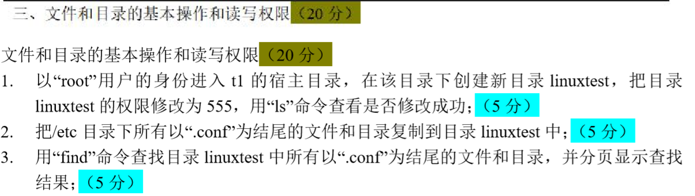
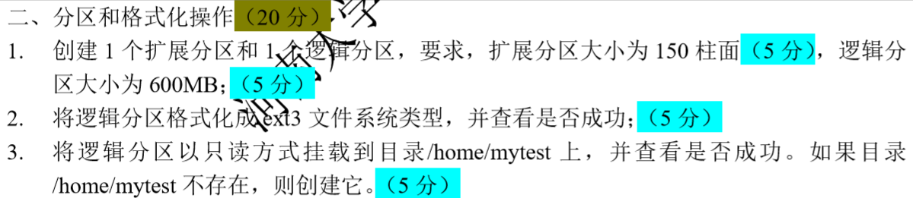

# 课程安排

> 期中，期末考试

---

## 课程方向

```
1. shell脚本
---			期中
2. 网络
---			期末
```

---

## 实际上课记录

- 从_02_开始有实验，每周上交一次实验，周一讲课，周五上机练习
- 2019年10月1日左右，vmware虚拟机随着win10更新不能正常启动，改使用云主机

# 往年例题

## 1 

### 期中







### 期末


## 2

> 都是期末题，而且都是上级题


