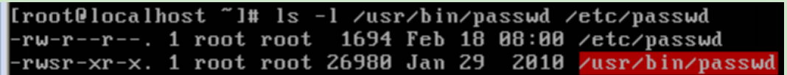

## linux常用命令

> 更改文件和目录的拥有者 chown (change owner)

```cmd
-R：对目录及该目录下的所有文件和子目录都进行相同的操作，即递归更改目录的所有者；
①chown rjxy file			#把文件file的所有者改为rjxy
②chown –R rjxy dir		#把目录dir及该目录下的所有文件和子目录的所有者都改为rjxy
```


> 更改文件和目录的组群：chgrp (change group)

```cmd
用法同chown
①chgrp rjxy file			#把文件file的组群改为rjxy
②chgrp –R rjxy dir		#把目录dir及该目录下的所有文件和子目录的组群都改为rjxy
```


> 改变文件和目录的存取权限:chmod

```cmd
1)数值模式
语法：chmod 【-R】 权限值 文件名1 文件名2 ……
-R：对目录及该目录下的所有文件和子目录都进行相同的操作；
①chmod 744 file			#把文件file的读写权限改为744，即rwxr--r—
②chmod -R 744 dir		#把目录dir及该目录下的所有文件和子目录的读写权限改为744
2)符号模式
chmod {a、u、g、o}{+-=}{rwx} 文件名1 文件名2 ……
a、u、g、o表示要赋予权限的用户的类，a代表所有的用户，u代表文件的所有者自身，g代表和所有者同组群的用户，o代表组外的其他用户
+-=用来增加、删除或设置权限，+表示增加权限，-表示删除权限，=表示设置权限
rwx表示要增加、删除或设置的权限值，r表示读权限，w表示写权限，x表示执行权限
①touch file			#新建文件file，其默认读写权限为644（rw-r--r--）
②chmod u+x file		#增加所有者对file的执行权（把file的权限改为744）
③chmod a-r file		#删除所有的人对file的读权限（把file的权限改为300）
④chmod g=rx file		#设置组群对file的具有读和执行的权限
```


> 查询命令 which

```cmd
1)which：搜索系统可执行文件（命令）的详细路径
①which pwd			#查看pwd命令的详细路径
2)whereis：搜索可执行文件（命令）、源代码文件、帮助文件及其他文件。
-b：定位可执行文件
-m：定位帮助文件
-s：定位源代码文件
-u：搜索默认路径下除可执行文件、源代码文件和帮助文件外的其他文件
①whereis tomcat 			#查找tomcat，若输出为“tomcat：”则表示没有找到
②whereis pwd				#查找pwd，显示所有结果
③whereis -b pwd			#查找pwd，只查找可执行文件（命令的二进制文件）
④whereis -m pwd			#查找pwd，只查找帮助文件
⑤whereis -s pwd			#查找pwd，只查找源文件
```


> 查询命令 find

```cmd
3)find：在系统特定目录下，查找名字具有某种特征或其具有某种属性的文件。
语法：find 【path】 -option 【-print】 【-exec –ok command】 {} \;
path：搜索范围，即指出要查找的目录，缺省为当前目录。例如，用“/”表示根目录；
-exec command {} \;：将查到的文件执行command命令，“{}”和“\;”之间有空格，“\;”的“;”为半角分号；
【常用选项】
-name：按文件名查找
-perm：按执行权限来查找
-user：按文件所有者查找
-group：按组查找
-mtime -n +n n：按文件更改时间查找文件，-n表示n天以内，+n表示n天以前，n表示确切n天
-atime -n +n n：按文件访问时间查找文件，-n表示n天以内，+n表示n天以前，n表示确切n天
-ctime -n +n n：按文件创建时间查找文件，-n表示n天以内，+n表示n天以前，n表示确切n天
-newer file1 !file2：查找更改时间比file1新，但比file2旧的文件
-type b/d/c/p/l/f：查找块设备、目录、字符设备、管道、符号链接和普通文件
-size n[ckMG]：查长度为n块的文件（c表示字节B，k表示kB，M表示MB，G表示GB）
①find -name abc				#在当前目录下查找名字为abc的文件
②find -name abc’*’			#在当前目录下查找名字以abc开头的文件，注意通配符“*”用半角单引号括起来
③find -name ‘*’abc’*’			#在当前目录下查找名字中包含abc的文件
④find /etc -perm 644			#在/etc目录中查找权限为644的文件
⑤find -type f -exec ls -l {} \;	#在当前目录下查找所有的普通文件，并在-exec选项中使用ls -l命令将它们列出
```

> 查询命令比较：locate最快，whereis&locate都是一样的原理，查找linux目录的索引表。find是通过便利目录来查找，更灵活。
>
> 常用场景：find结合无名管道,whereis定位文件|目录。

## 隐藏属性

> 隐藏属性指不能用 `ls -al` 查看的属性。
>
> 里面有两个可以阻止任何人包括root删除和修改文件本身。

```cmd
1)设置文件的隐藏属性：chattr
语法：chattr 【+-=】 【ASacdistu】 文件/目录
+：在原有基础之上添加参数
-：在原有基础之上删除参数
=：重新设置参数
a：可向其增加数据，不能删除/修改数据
c：文件自动压缩存储（读取时会自动解压缩）
d：当dump备份时，该文件/目录不会被备份
i：不可删除、改名，无法写入数据
s：删除时彻底删除，数据区会被0回写覆盖，无法恢复。
u：与s相反，删除时数据区不会被覆盖。
①chattr +i /etc/inittab			#保护文件inittab不能被做任何修改，执行后，该文件不能被编辑、移动或删除
②chattr –i /etc/inittab			#去除对文件inittab的保护
③chattr +a /root/mylog			#保护日志文件mylog，只能向后追加数据，不能修改或删除（可用“>>”向文件中追加数据）
echo qqq >> mylog	#用echo命令和>>将字符串“qqq”追加到文件mylog后面
2)查看隐藏属性：lsattr
语法：lsattr 【-adR】 文件/目录
-R：递归显示子目录
-a：显示所有文件
-d：显示目录自身的信息，不显示目录的内容（和ls命令的-d选项作用类似）
①chattr  +i  x	#给文件x添加隐藏权限
lsattr  x		#查看文件x的隐藏权限，显示结果：-----a-------e-，其中a表示可向其追加数据，不可删除或修改数据；e表示该文件位于扩展分区，该属性是只读的，不能修改
```


## 文件的权限

```
用户创建文件或目录时自动赋予默认读写权限，默认值为666（文件）和777（目录），即每一类用户创建文件时可以为其赋予的默认最大值为6，系统不允许在创建文件时就赋予它执行权限，而要在创建后用chmod命令增加这一权限，这样可以更好地保证系统安全。但是目录的执行权比较特别，如果没有执行权，则用户无法进入该目录，所以目录的最大权限值可以到7。
```

```cmd
修改默认权限：umask
```

### umask语法

```
umask xyz

#xyz为数值，如022，表示从默认权限中取走的权限，即取走了写权限，而非666或777与该数值的差值

eg:
root:umask 
:022
root:touch a.txt&ll
:-rw-r--r-- a.txt
# root更改umask值
root:umask 333
# root查看已经更改的umask
root:umask
:333
root:touch b.txt&ll
:-rw-r--r-- a.txt
 -r--r--r-- b.txt
```

```
umask333就是去掉333对应的权限。
本来文件有666呢，但是333后，会去掉wxwxwx，故就变成444了。
```

```
值得注意的是，使用umask改变umask值并非是永久性的，可以通过切换用户撤销之前对umask值的更改。
eg:
root:umask 333
root:su XXX
XXX:su
~
root:umask
:022
```

> umask就这么简单。

### 文件的特殊权限

>  setuid，setgid，stick bit

#### setuid，setgid

```cmd
1)setuid和setgid：让普通用户在执行该文件时拥有“文件所有者”的权限
查看/usr/bin/passwd和/etc/passwd的权限
①ls –l /usr/bin/passwd /etc/passwd				#查看/usr/bin/passwd和/etc/passwd文件的读写权限，结果如下
```



```cmd
【注意】/usr/bin/passwd是命令，任何用户都可以使用该命令修改个人密码，root用户可以用该命令修改所有用户的密码。/etc/passwd是文件，存放各个用户的账户和密码信息。从读写权限上看，仅root用户对/etc/passwd文件具有修改权限（写权限），但是实际上每个用户都可以通过/usr/bin/passwd修改密码从而修改/etc/passwd文件。Why?
	/usr/bin/passwd的读写权限中的“s”，即setuid，表示普通用户执行此命令时暂时拥有“此文件所有者”的权限（对/usr/bin/passwd来说即root权限）。当此命令执行完，权限也随之失去。
      ★ Linux中的命令默认所有者都是root。
类似的，setgid则表示让执行文件的用户以该文件所属组的权限去执行。
★ setuid和setgid权限只对可执行文件有意义。
```

#### stick bit：查看/tmp目录的权限

```cmd
①ls –dl /tmp					#查看/tmp目录的读写权限
/tmp目录的读写权限为drwxrwxrwt，其中“t”即为stick bit（粘滞位），表示只有文件的所有者和root用户有权限删除它里面的文件，除此之外其他用户不能删除和修改这个文件。即/tmp作为用户共有的临时文件夹，任何用户都有读写权限，stick bit可以避免A用户在该目录下创建的临时文件被B用户删除。
stick可以用于共享的目录，可以放开目录的全部权限，每个人都可以使用该目录，但是不能删除其他用户的文件。
【特殊权限举例】
使用字符设置特殊权限
①chmod u+s file			#设置setuid
②chmod u-s file			#删除setuid
③chmod g+s file			#设置setgid
④chmod o+t directory		#设置stick bit
使用数值设置特殊权限：在普通读写权限值前面添加特殊权限位
	setuid	setgid	stick bit
	1	1	1
其中，setuid对应的二进制数值为100（八进制数为4）；setgid为010（2）；stick bit为001（1）。如需增加某个特殊权限，只需要将对应的八进制数值叠加即可。
①chmod 4644 file			#修改文件file的读写权限为644，并设置setuid
②chmod 2644 file			#修改文件file的读写权限为644，并设置setgid
③chmod 1644 file			#修改文件file的读写权限为644，并设置stick bit
④chmod 6644 file			#修改文件file的读写权限为644，并设置setuid和setgid
【注意】由于特殊权限和执行权位置相同，所以当给文件设置特殊权限时，如果文件具有可执行权，则特殊权限是小写的s或t，如果文件没有可执行权，则特殊权限是大写的S或T。
```


