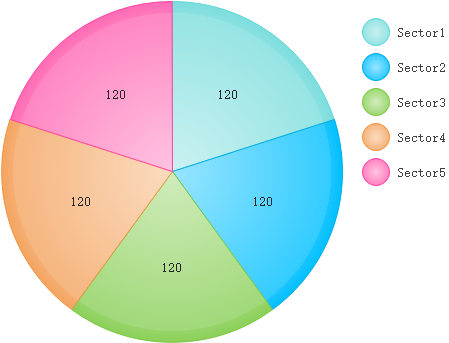

## vim编辑器使用

```
普通模式下：
	r--替换
	o--下一行编辑
```

```c
vim可以打开多个文件。
    vim file1 file2
文件之间切换
   	:bn(下一个)
    :bp(上一个)
文件分窗格显示
    :split(分为上下两个文件)
    :vsplit(分为左右两个文件)
    ctrl + w + (hjkl)在两个窗格间跳换
```

## linux文件系统分区

```
一块儿硬盘：
最多有4个主分区
最多有1个扩展分区
最多有12个逻辑分区
#
1.创建分区
2.格式化
3.挂载
```

### 主分区&扩展分区&逻辑分区之间的关系

```
我们说分区就像柜子的隔板。
只有在柜子中打好隔板，那么我们放衣服才会更舒服。
那么，主分区是可以直接存放数据的。
扩展分区只能用来容纳逻辑分区。逻辑分区也可以直接存放数据。
```

### 分区的作用

> 分区，就像古代诸侯国之间领土的划分。为了更好的统治自己的领土，首先要做的就是确定自己能够管到哪儿。
>
> 分区是为格式化做准备。

## linux&windows格式化

### windows格式化

```c
# 格式化D盘
format d:
```

### linux格式化

```c
mkfs
```

## linux磁盘用量工具

```c
# 区块为1K字节
df
# 以常用容量单位显示
df -h
```

>  df详细用法

```c
语法：df [选项] [文件]
-a：全部文件系统列表
-h：以常用容量单位显示
-i：显示inode信息
-k：区块为1K字节
-l：只显示本地文件系统
-m：区块为1M字节
-T：显示文件系统类型
--block-size=<区块大小>：指定区块大小，单位为B
-t<文件系统类型>：只显示指定文件系统的磁盘信息
-x<文件系统类型>：不显示指定文件系统的磁盘信息
①df
②df –h						#以常用容量单位显示目前磁盘空间使用情况
③df –m						#指定区块大小为1M
④df –T						#显示文件系统类型
⑤df –t ext4					#显示类型为ext4的分区
⑥df –i						#显示inode信息（文件个数）
```

---

```c
du
显示文件和目录的磁盘使用空间
```

```c
语法：du [选项] [文件]
-a或-all：每个指定文件显示磁盘使用情况，或者为目录中每个文件和子目录显示各自磁盘使用情况
-b或-byte：显示目录或文件大小时，以byte 为单位
-c或--total：除了显示个别目录或文件的大小外，同时也显示所有目录或文件的总用量
-s：只显示总用量
-k或--kilobytes：以KB（1024bytes）为单位输出
-m或--megabytes：以MB 为单位输出
①touch  w
mkdir  -p  m/n/q
touch  m/b  m/c  m/d  m/n/x		#在当前目录下创建文件w和目录m，并在目录m中创建文件b、c、d和子目录n，在子目录n中再创建文件x和子目录q
②du m						#显示目录m及所有子目录的磁盘使用情况
③du –a m 					#显示目录m及目录m中的所有文件和子目录的磁盘使用情况
④du –b m					#显示目录m和所有子目录的使用情况，结果以byte为单位显示
⑤du w						#显示文件w的磁盘使用情况
```

## linux分区工具 fdisk

> fdisk是一个问答式的磁盘分区软件

```c
fdisk基操:

#对第一块sata接口的硬盘分区
fdisk /dev/sda
#对所做操作写入
w
```



---

### 扇区 sector

| Device | Boot     | Start    | End      | Blocks                                                       | Id           | System       |
| ------ | -------- | -------- | -------- | ------------------------------------------------------------ | ------------ | ------------ |
| 设备名 | 引导分区 | 开始柱面 | 结束柱面 | 分区容量，有时候会显示一个加号“+”，表示block的数量不是整数，可能还有小数 | 分区系统编号 | 分区系统类型 |

### fdisk上手

```c
# fdisk那块儿硬盘(需要root权限)
fdisk /dev/sda
```

```c
WARNING: DOS-compatible mode is deprecated. It's strongly recommended to
         switch off the mode (command 'c') and change display units to
         sectors (command 'u').

Command (m for help): 

```

```
#显示分区用量 
p
```

```
Disk /dev/sda: 21.5 GB, 21474836480 bytes
255 heads, 63 sectors/track, 2610 cylinders
Units = cylinders of 16065 * 512 = 8225280 bytes
Sector size (logical/physical): 512 bytes / 512 bytes
I/O size (minimum/optimal): 512 bytes / 512 bytes
Disk identifier: 0x0007f334

   Device Boot      Start         End      Blocks   Id  System
/dev/sda1   *           1        2481    19921920   83  Linux
/dev/sda2            2481        2611     1048576   82  Linux swap / Solaris
```

| Device | Boot     | Start    | End      | Blocks                                                       | Id           | System       |
| ------ | -------- | -------- | -------- | ------------------------------------------------------------ | ------------ | ------------ |
| 设备名 | 引导分区 | 开始柱面 | 结束柱面 | 分区容量，有时候会显示一个加号“+”，表示block的数量不是整数，可能还有小数 | 分区系统编号 | 分区系统类型 |

> 其中的16065×512表示heads×sectors，每个sectors容量为512byte

> blocks=（End -  Start）×Units/（1024×1024）		#单位为MB

```
#创建新分区
n
```

```
# 如果没有扩展分区，则不会有l(logical partition)的选项。
# 同理，如果有扩展分区，则不会有e(extends partition)的选项。
Command action
   e   extended
   p   primary partition (1-4)
```

> 接下来是创建扩展分区

```c
Command (m for help): n
Command action
   e   extended
   p   primary partition (1-4)
e
Partition number (1-4): 3
First cylinder (893-1044, default 893): 
Using default value 893
Last cylinder, +cylinders or +size{K,M,G} (893-1044, default 1044): +100M

Command (m for help): p

Disk /dev/sda: 8589 MB, 8589934592 bytes
255 heads, 63 sectors/track, 1044 cylinders
Units = cylinders of 16065 * 512 = 8225280 bytes
Sector size (logical/physical): 512 bytes / 512 bytes
I/O size (minimum/optimal): 512 bytes / 512 bytes
Disk identifier: 0x00035f6f

   Device Boot      Start         End      Blocks   Id  System
/dev/sda1   *           1         766     6144000   83  Linux
Partition 1 does not end on cylinder boundary.
/dev/sda2             766         893     1024000   82  Linux swap / Solaris
Partition 2 does not end on cylinder boundary.
/dev/sda3             893         906      108421    5  Extended
```

```
#将修改保存
w
```

### fdisk创建交换分区&格式化&挂载

```c
1)添加交换分区
①用fdisk创建交换分区
fdisk /dev/sda
n→p→4
②partx -a /dev/sda				#更新分区信息
③mkswap /dev/sda4			#把该分区格式化为交换分区
④查看当前交换分区大小
free				#看最后一行
⑤立即启用新加入的交换分区
swapon /dev/sda5
free				#和③的结果作对比
⑥若要系统启动时自动挂载新交换分区，则需要在/etc/fstab中加入一行内容
/dev/sda3	swap	swap	defaults	0	0
设备名	挂载点	文件系统格式	挂载参数	转存选项，若为0，表示不备份	系统检查选项，若为0，表示不检查
【注意】修改/etc/fstab时千万不要改动其他分区的信息，否则可能可能造成系统不能启动！！！！！
2)删除交换分区
①关闭交换分区
swapoff /dev/sda4
②从/etc/fstab中删除该项目
③使用fdisk删除该分区
fdisk /dev/sda
```

## 格式化

```c
# 查看linux支持的文件类型
ll /lib/modules/2.6.32-131.0.15.el6.i686/kernel/fs
```

```
总用量 124
drwxr-xr-x. 2 root root  4096  2月 23 2019 autofs4
drwxr-xr-x. 2 root root  4096  2月 23 2019 btrfs
drwxr-xr-x. 2 root root  4096  2月 23 2019 cachefiles
drwxr-xr-x. 2 root root  4096  2月 23 2019 cifs
drwxr-xr-x. 2 root root  4096  2月 23 2019 configfs
drwxr-xr-x. 2 root root  4096  2月 23 2019 cramfs
drwxr-xr-x. 2 root root  4096  2月 23 2019 dlm
drwxr-xr-x. 2 root root  4096  2月 23 2019 ecryptfs
drwxr-xr-x. 2 root root  4096  2月 23 2019 exportfs
drwxr-xr-x. 2 root root  4096  2月 23 2019 ext2
drwxr-xr-x. 2 root root  4096  2月 23 2019 ext3
drwxr-xr-x. 2 root root  4096  2月 23 2019 ext4
drwxr-xr-x. 2 root root  4096  2月 23 2019 fat
drwxr-xr-x. 2 root root  4096  2月 23 2019 fscache
drwxr-xr-x. 2 root root  4096  2月 23 2019 fuse
drwxr-xr-x. 2 root root  4096  2月 23 2019 gfs2
drwxr-xr-x. 2 root root  4096  2月 23 2019 jbd
drwxr-xr-x. 2 root root  4096  2月 23 2019 jbd2
drwxr-xr-x. 2 root root  4096  2月 23 2019 jffs2
drwxr-xr-x. 2 root root  4096  2月 23 2019 lockd
-rwxr--r--. 1 root root 12468  5月 11 2011 mbcache.ko
drwxr-xr-x. 2 root root  4096  2月 23 2019 nfs
drwxr-xr-x. 2 root root  4096  2月 23 2019 nfs_common
drwxr-xr-x. 2 root root  4096  2月 23 2019 nfsd
drwxr-xr-x. 2 root root  4096  2月 23 2019 nls
drwxr-xr-x. 2 root root  4096  2月 23 2019 squashfs
drwxr-xr-x. 2 root root  4096  2月 23 2019 ubifs
drwxr-xr-x. 2 root root  4096  2月 23 2019 udf
```

### mkfs

```c
#扩展分区是用来放逻辑分区的，它就不要创建文件系统了
#刷新分区表，为了mkfs可以找到刚创建的分区(需要多使用几次，知道找到分区为止)
partx -a /dev/sda5
#创建文件系统(对/dev/sda5创建ext3的文件系统)
mkfs -t ext3 /dev/sda5
或
mkfs.ext3 /dev/sda5
```

### 挂载&卸载文件系统

```c
#把/dev/sda5挂载到rjxy的桌面的ee上
mount /dev/sda5 /home/rjxy/桌面/ee
#卸载
umount /dev/sda5
#以只读方式挂载
mount -o ro /dev/sda5 /home/rjxy/桌面/ee
mv: 无法进行跨设备的移动："bb" 至"ee/bb"；无法删除目标: 只读文件系统
#查看所有已挂载的分区
mount -s
```

```
/dev/sda1 on / type ext4 (rw)
proc on /proc type proc (rw)
sysfs on /sys type sysfs (rw)
devpts on /dev/pts type devpts (rw,gid=5,mode=620)
tmpfs on /dev/shm type tmpfs (rw,rootcontext="system_u:object_r:tmpfs_t:s0")
none on /proc/sys/fs/binfmt_misc type binfmt_misc (rw)
vmware-vmblock on /var/run/vmblock-fuse type fuse.vmware-vmblock (rw,nosuid,nodev,default_permissions,allow_other)
sunrpc on /var/lib/nfs/rpc_pipefs type rpc_pipefs (rw)
/dev/sda5 on /home/rjxy/桌面/ee type ext3 (ro)
[root@bogon 桌面]# 
```

> mount 是一种临时挂载，重启后则消失。
>
> 如果想用就挂载，则需编辑配置文件

```c
su
vim /etc/fstab
#添加以下这么一行(不必对齐)
/dev/sda5               /home/rjxy/桌面/ee           ext3    defaults        0 0
#重启电脑看一下
init 6
mount -s
```

| /dev/sda5 | /mount/aa | ext3         | defaults | 0                           | 0                               |
| --------- | --------- | ------------ | -------- | --------------------------- | ------------------------------- |
| 设备名    | 挂载点    | 文件系统格式 | 挂载参数 | 转存选项，若为0，表示不备份 | 系统检查选项，若为0，表示不检查 |

## 使用UUID挂载文件分区

★一般服务器都有多个硬盘分区，在重启后，这些分区的逻辑位置加载时可能会发生变动，如果使用传统的设备名称(例如：/dev/sda)方式挂载磁盘，就可能因为磁盘顺序变化而造成混乱。Linux环境中每个Block Device都有一个全局唯一的UUID，可以标识这个设备，我们可以在fstab中使用UUID替换设备名称，这样就不会产生上述混乱的情况了。

★使用blkid命令可以获取设备的UUID

```
/dev/sda1: UUID="b4a4fd17-c584-4ac7-9f79-92256ec2b219" TYPE="ext4" 
/dev/sda2: UUID="798a1829-9bc7-49e2-baec-26447df23206" TYPE="swap" 
/dev/sda5: UUID="9aa9f436-1c4a-4e6c-9914-0770ec45ba82" TYPE="ext3"
```