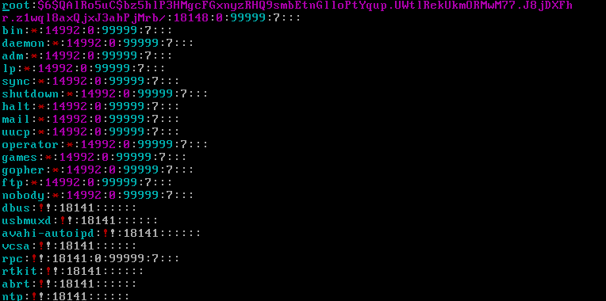
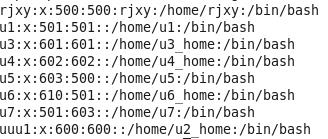
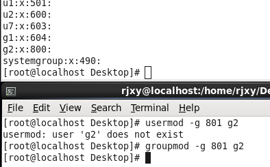
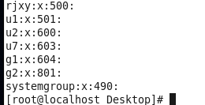
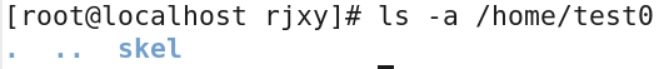

## linux用户配置文件

> 都需要root权限

### passwd

```
vim /etc/passwd
```

| rjxy   | :    | x                                     | :    | 508           | :    | 508         | :    |                        | ：   | /home/rjxy   | :    | /bin/bash                                            |
| ------ | ---- | ------------------------------------- | ---- | ------------- | ---- | ----------- | ---- | ---------------------- | ---- | ------------ | ---- | ---------------------------------------------------- |
| 用户名 |      | 密码，真实密码存放在/etc/shadow文件中 |      | 用户标识号UID |      | 组标识号GID |      | 用户名全称，可以不设置 |      | 用户宿主目录 |      | 用户的shell类型，有bash、sh和nologin三种，默认为bash |

- shell为/sbin/nologin表示该用户在本地没有登录权限，如果用su切换用户，会提示无法登录。
  - 
- 用户全名称为注释
- root用户默认的uid是0，普通用户默认的uid是从500开始。在0到500之间的是系统启动起来必须要创建的用户。

### shadow

```
vim /etc/shadow
```

| rjxy   | :    | $jlsflsdfsdjfkjfdsjfd                                        | :    | 15636                                          | :    | 0                                            | :    | 99999                                           | ：   | 7                            | :    |                              | ：   |                                                  | :    |      |
| ------ | ---- | ------------------------------------------------------------ | ---- | ---------------------------------------------- | ---- | -------------------------------------------- | ---- | ----------------------------------------------- | ---- | ---------------------------- | ---- | ---------------------------- | ---- | ------------------------------------------------ | ---- | ---- |
| 用户名 |      | 加密后的真实密码。【注意】如果密码前面有“！”或者“！！”表示该用户的密码被锁定，不能登录 |      | 上次修改密码的时间，从1970年1月1日开始算的天数 |      | 两次修改密码间隔最少的天数， 0表示禁用此功能 |      | 两次修改密码间隔最多的天数，99999表示禁用此功能 |      | 提前多少天警告用户密码将过期 |      | 密码过期之后多少天禁用此用户 |      | 用户过期的日期，依然是从1970年1月1日开始算的天数 |      | 保留 |



> tips:登录Linux系统时，系统需要读取上述两个文件。所以如果要备份Linux系统的账户，需要同时备份/etc/passwd和/etc/shadow这两个文件。

---

## linux对用户操作的命令

### useradd

```
创建用户账户：useradd
	创建新账户，然后为新用户分配用户号、用户群组、宿主目录和登录shell等
-u：创建用户时，将其UID设置为指定值
-d：创建用户时，将其宿主目录设置为指定目录
-g：创建用户时，将其所属组设置为指定组
-o：为多个用户设置相同的UID
-m: 强制一定创建宿主目录。
-M：强制一定不创建宿主目录。
```

```
#添加新用户&设置密码(否则其他用户无法切换到新用户(除了root))
useradd u1
passwd u1
#添加uid为600的用户&设置密码(接下来添加用户的uid默认为601)
useradd -u 600 u2
passwd u2
#添加uid默认为601的用户&设置密码
useradd u3
passwd u3
#添加新用户并设置家目录为自定义滴目录(该目录可以不存在)
useradd u4 -d /home/u4_home
passwd u4
#切换到这个新设用户&切换到该家目录&查看根目录路径
su u4
cd ~&pwd
#创建用户u5&设置其组id为u1(用户可以有多个组)
useradd u5 -g u1
passwd
#设置用户u6&设置其uid为502&组id为u1(因为rjxy u&gid=500,u1 u&gid=501)&自定义家目录
useradd u6 -u 502 -g u1 -d /home/u6_home
passwd
#设置uid为501的用户(uid=501的用户已经存在，因此需要加-o选项)
useradd u7 -o -u 501
```

### usermod

> user modify

```
usermod
	修改用户账户
-u：修改UID
-d：修改用户的宿主目录
-l：修改用户名
-g：修改用户的组
-e：设置有效期限
-L：锁定用户
-U：解锁用户
```

```
#修改u2的家目录为u2_home(不会主动创建家目录，需要手动mkdir)(需要copy配置文件到家目录，否则bash会变成bash-4.1$)
mkdir /home/u2_home
usermod -d /home/u2_home u2
#对上面的那条命令的一步到位
usermod -d /home/u3_home -m u3
#把u2的名字改为uuu2
usermod -l uuu2 u2
```



```
#将u7的群组修改为u1
usermod -g u1 u7
#将u3账户锁定，除root外其他用户无法切换
root:usermod -L u3
su rjxy
su u3
#将u3账户解锁(UnLock)
root:usermod -U u3
#查看u3的状态
root:passwd -S u3
```

### userdel

```
#删除用户u3,但保留家目录
关闭所有终端，再打开一个终端，切换root
userdel u3
#删除用户u4,不保留家目录
userdel -r u4
```

## 一些配置文件

> linux对组的一些操作的前铺垫

```
#存放用户启动文件，由root用户管理，创建用户后自动复制目录下的启动文件到新用户宿主目录下。启动文件都是隐藏文件，需要加“–a ”参数查看。
/etc/skel
```

```
#可查看UID和GID的允许范围
/etc/login.defs	
```

```
#用useradd命令创建用户时的规则文件
/etc/default/useradd
```

```
#用户组配置文件(一个用户可以属于一个或多个组，同一个组内的用户之间有相似特性)
/etc/group

a若某用户属于root组，则其可以浏览root用户的宿主目录（ls –ld /root可以看到，/root目录对于root群组可读）；
b若root用户把某个文件权限对组放开，则root组所有用户都可修改此文件；
```

```
若某个用户文件非常重要，应让其拥有独立的组，或把用户的文件权限设为完全私有！
```

```
group配置文件详解
	root	：	x	：	0	：	
	用户组名称		密码，真实密码放在/etc/gshadow中		GID
	普通群组GID从500开始		组成员，不显示以这个组作为初始组的成员
```

```
#用户组影子文件
/etc/gshadow

root	：		：		：	
组名称		密码		组的管理者，若为root则省略		组成员列表
```

### groupadd

```
#新增组g1
groupadd g1
#新增组g2,设置其组id为800
groupadd -g 800 g2
#新增系统组(组id<500)
groupadd -r systemgroup
#查看新增组信息
cat /etc/group
```

### groupmod





```
#将组g2的数值修改为801
groupmod -g 801 g2
#将组g2的名字修改为ggg2
groupmod -n ggg2 g2
#重复设置ggg2的组id
groupmod -g 801 -o ggg2
```

### groupdel

```
#删除ggg2(若组中包含用户，则需先删除用户)
groupdel ggg2
```

## 创建用户和组的特殊方法

### 1修改配置文件

```
#添加用户记录
vim /etc/passwd
```

| test0 | ：   | x    | ：   | 508  | ：   | 508  | :    |          | :    | /home/test0 | :    | /bin/bash |
| ----- | ---- | ---- | ---- | ---- | ---- | ---- | ---- | -------- | ---- | ----------- | ---- | --------- |
|       |      |      |      |      |      |      |      | 用户全名 |      |             |      |           |

### 2.执行pwconv，让/etc/passwd和/etc/shadow同步，然后查看是否同步

```
cat /etc/shadow
pwconv
cat /etc/shadow					#test0的信息同步到了/etc/shadow中
```

### 3.修改/etc/group，添加私有组

```
①vi /etc/group
	添加内容“test0:x:508:”
②grpconv同步/etc/group和/etc/gshadow文件
grpconv
cat /etc/gshadow				#组test0的信息同步到了/etc/gshadow中
```

### 4.修改宿主目录

#### 1.创建用户主目录，并把启动文件复制过去

```
#创建家目录
mkdir /home/test0
#复制必备文件(隐藏的文件)到家目录
cp -r /etc/skel/. /home/test0
#显示一下复制到隐藏文件了没有
ls -a /home/test0
```

#### 2.改变新增用户宿主目录的属主和权限

```
#查看/home/test0目录的属主和权限（属于root）
ls -ld /home/test0
#把/home/test0的属主和属组都改为test0（第一个test0为属主，第二个test0为属组），参数R为递归，即对目录和目录下所有的文件和子目录都做修改
chown -R test0.test0 /home/test0
#改变宿主目录的读写权限，仅test0具有所有权限
chmod 700 /home/test0
#显示宿主目录所有更改是否生效
 ls -ld /home/test0
```

### 5.设置新用户的密码

```
passwd test0
```

#### 6.测试用户是否添加成功

```
su test0
```

>  此时若命令提示符为“bash -4.1”，表示用户宿主目录有问题
>
> 此时`ls -a /home/test0`查看，如果是如下内容，表示复制启动文件时出错。
>
> 
>
> 应该为：`cp  -r  /etc/skel/.  /home/test0`

## 用户和组维护命令

### passwd

```
#设置当前用户密码
passwd	
#设置指定用户密码
passwd test0
#锁定test0密码，其无法登录
passwd -l test0	
#解锁test0
passwd -u test0
#查看用户密码信息
cat /etc/shadow |grep test0
#删除密码
passwd -d test0
#查看用户密码信息
cat /etc/shadow |grep test0
```

### gpasswd

> 设置组密码，或在组中添加、删除用户

```
#把test0用户添加到rjxy组中
gpasswd –a test0 rjxy
#查看test0的分组
id test0
cat /etc/group|grep test0		#可看到rjxy最后一项添加了test0
#把test0用户从rjxy组中删除
gpasswd –d test0 rjxy
id test0
#可看到rjxy最后一项没有了test0
cat /etc/group|grep test0
#设置组test0的密码
gpasswd test0	
#取消组test0的密码
gpasswd –r test0	
```

```
su：切换用户
pwck：检验用户配置文件/etc/passwd和/etc/shadow内容是否合法完整
① pwck
② rm -rf /home/test0
pwck
```

## 账户信息显示(finger&id&w&who)

```
finger
#显示test0的信息
finger test0
#显示所有登录用户的信息
finger					
#可在tty2中登录root用户，再回到图形界面用finger查看，然后在tty2中退出root，再用finger查看，比较结果
```

```
#显示用户的UID、GID和所属组
id
```

```
#详细查询当前已登录的用户
w
```

```
#显示已登录用户的简单信息
who
```

## 图形界面下用户和组的配置

```
系统→管理→用户和组
```


