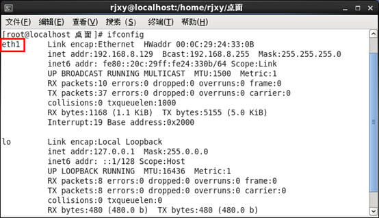
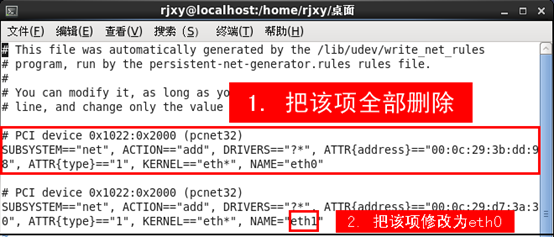
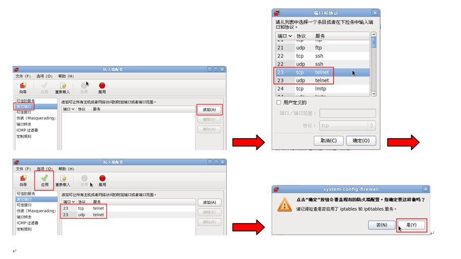
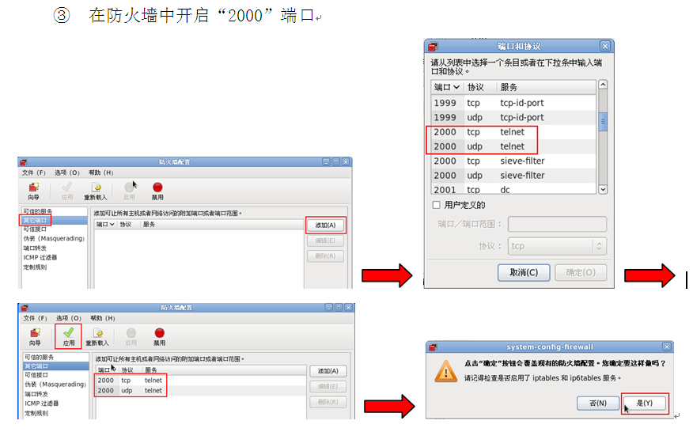

## 虚拟机网络设置

> 由于学校无法连接互联网，因此用ping命令检测物理机和虚拟机是否连通。

> 有的虚拟机因为是复制过来的，因此ifconfig后查到的是eth1而不是eth0。

> root可以使用ifconfig命令临时修改ip地址。

> 接下来会围绕这一系列的问题来进行配置。

```
1.修改虚拟机为桥接模式(包括修复虚拟机ifconfig查到为eth1的问题)
2.为虚拟机设置静态IP，使物理机和虚拟机互相能ping通。(可能要配置防火墙--防火墙是运输层，拦截的是端口)
```

### 改网络为eth0的步骤

> 1.ifconfig查看网卡信息



> 发现为eth1,得修复

> 2.修改`/etc/udev/rules.d/70-persistent-net.rules`  



> 注释也行

> 3.重启系统`init 6`

> 4.`ifconfig`确认已经变成eth0。

> 5.对比`ifconfig`和`/etc/sysconfig/network-scripts/ifcfg-eth0  `中的HWADDR(硬件HardWare地址)。
>
> if(!equals)
>
> ​	修改`/etc/sysconfig/network-scripts/ifcfg-eth0  `,使其和ifconfig查到的mac地址一致。

> 6.`service network restart`,`ifconfig`

### Linux网络配置（临时修改IP地址等信息）

> ifconfig命令参数讲解

```
up：启动指定的网络设备（激活）
down：关闭指定的网络设备
netmask：设置子网掩码
```

> ifconfig命令实例

```
#su
#设置eth0网卡的ip为192.168.0.8，子网掩码为255.255.0.0，并激活此配置
ifconfig  eth0  192.168.0.8  netmask  255.255.0.0  up
#查看eth0的配置信息
ifconfig eth0
```

### Linux网络配置文件详讲（永久修改IP地址等信息）

位置:`/etc/sysconfig/network-scripts/ifcfg-eth0`

参数：

```c
			HWADDR：MAC地址
			ONBOOT：启动系统时是否激活该配置（yes-激活，no-不激活）
			TYPE：网络连接方式（Ethernet-有线，Wireless-无线）
			BOOTPROTO：IP分配方式（dhcp-动态IP，static/none-静态IP）
			IPADDR:	IP地址
			PREFIX：子网掩码
			GATEWAY：网关
			DNS1/DNS2：域名解析服务器
【修改内容如下】
            DEVICE=eth0					//网络名不需要修改 
			HWADDR=00:10:5A:5E:B1:E4		//网卡MAC地址，无需更改 
			ONBOOT=yes					//系统启动时激活
			TYPE=Ethernet 				//网络连接方式为本地连接 
			BOOTPROTO=static 			//使用静态ip地址
			IPADDR=192.168.0.8			//ip地址 
			PREFIX=24			 		//子网掩码
			GATEWAY=192.168.6.1			//网关
			DNS1=202.196.96.131			//域名解析服务器，因为还有备用DNS，所以此处为DNS1
```

修改之后：

```
#重启网络服务，使配置文件生效
service network restart
## 如果重启服务时发现`活跃连接路径：/org/freedesktop/MetworkManager/ActiveConnection/1[确定]`，则说明这个守护进程需要关闭。(这个守护进程也是接管网络的，为了不让它干扰，所以需要把它关闭)
	#关闭NetworkManager服务
	service  NetworkManager  stop	
	#重启network服务
    service network restart	
    #激活eth0网卡
    ifup eth0	
    #查看IP地址是否生效
    ifconfig eth0						
```

### 测试网络是否连通

```
1.把VMware虚拟机中的Redhat系统的网络连接方式设为“桥接”；
2.把虚拟机和实体机的IP地址设在同一个网段，即IP地址的前三段保持一致；(不一定，只要网络名一致即可)
3.关闭win7(物理机)的防火墙和Redhat的selinux防火墙；
```

#### 怎么关闭Redhat的防火墙

```
#临时关闭
setenforce 0
```

```
#永久关闭
vim /etc/selinux/config
#将SELINUX的值修改
SELINUX=enforcing->SELINUX=disabled
#重启服务器使修改生效
init 6
```

```
4.假设：虚拟机中Redhat的IP设置为192.168.2.1，实体机中win 7的IP设为192.168.2.2；
#在Redhat中ping win7 的IP
ping  192.168.2.2
#在win7中ping  Redhat的IP
ping  192.168.2.1
```

## 虚拟机配置远程登录

### telnet远程登录

> telnet密码用明文传送，不安全，因此系统会千方百计地阻挠你使用telnet进行登录。所有的所有，只为你的安全着想。

```
#用rpm命令查看是否安装了telnet，应该有“telnet”和“telnet-server”两个软件，如果没有显示结果，表示系统中没有安装，则需要安装这两个软件
rpm  -qa|grep telnet
#查看虚拟机光盘里的镜像是否被挂载(一般被挂载，路径是/media/...)
mount –s
#切换到光驱的挂载点，因为挂载点的名字中含有空格，必须在空格前面添加“\”连接，或者在输入时用tab键自动完成
cd /media/ RHEL_6.1\ i386\ Disk\ 1	
cd Packages
#查看telnet，telnet-server是否安装
rpm -qa|grep telnet
#查看telntet和telnet-server的完整名称
ls |grep telnet-server
#安装telnet需要先安装它的依赖xinetd。
	##查看xinetd的完整名字
	ls |grep xinetd	
	##安装xinetd
	rpm -ivh xinetd-2.3.14-31.e16.i386.rpm
##安装telnet，（client,server）
rpm –ivh telnet-0.17-46.e16.i686.rpm
rpm -ivh  telnet-server-0.17-46.e16.i686.rpm
#查看telnet和telnet-server是否安装成功
rpm -qa|grep telnet

#备份telnet配置文件(linux中，备份文件是为了修改文件出错恢复起来方便，这是一个好习惯)
cp  /etc/xinetd.d/telnet  /etc/xinetd.d/telnet.bak	
#将此文件中的disable后面改为no(安装以后默认禁用telnet，此处可以看出阻挠一)
#启动telnet服务
service xinetd restart

#本地用普通用户测试telnet是否能正常登陆(不用root原因是root登陆不进去,此处可以看出阻挠二)
telnet 127.0.0.1

#配置root可以使用telnet(将这个文件删除或改名)
mv /etc/securetty /etc/securetty.bak

##如果遇到telnet无法连接，需要配置23端口(ssh因为更安全，因此23端口默认开启，此处可以看出阻挠三)

##至此，root可以使用telnet远程登录
```

#### 配置端口

【解决方法】在linux防火墙中打开23号端口，包括TCP端口和UDP端口

系统→管理→防火墙→选择“其他端口”→添加→把“23 tcp telnet”和“23 udp telnet”添加上→点“应用”



##### 修改默认端口

```
#修改/etc/services文件，把telnet的“tcp”和“udp”端口号改为其他数值，如“2000”
vim /etc/services
#重启xinetd(其实就是telnet)服务
service xinetd restart
#在防火墙中开启“2000”端口
```




### ssh远程登录

> 对比telnet,安全性更高，加密传输。

```
#查看openssh是否安装，如果安装，应该包含以下三个软件：openssh-server（服务器端）、openssh-clients（客户端）和openssh-5.3p1（公共核心）#先安装公共核心
rpm –qa|grep openssh
#启动sshd服务
service sshd start
#关闭sshd服务
service sshd stop	
#重新启动sshd服务
service sshd restart
#查看sshd服务的运行状态
service sshd status					
#在本地登录SSH服务器
ssh rjxy@127.0.0.1
```


