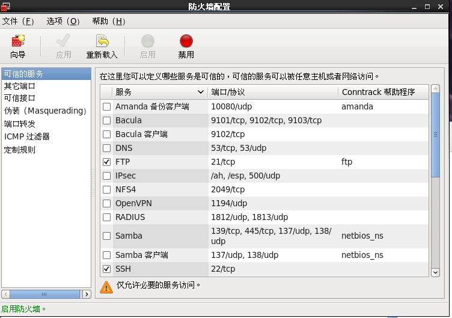

> 毫无疑问，ftp协议是基于TCP的。这也就决定了我们得从网络层说起。

## 网络层

> 服务器需要，有必要得到1个固定的ip地址。

> TCP面向连接。其中纷繁复杂的细节可以不管。只需要C,S都安装了TCP协议栈即可。

> C,S经过n个路由，传递数据包。

## 运输层

> ftp占2个端口。

> ftp服务器&客户端占21端口。
>
> ftp服务器&客户端占20端口。

```
21端口用于连接，20端口用于传输数据。

进行FTP文件传输中，客户端首先连接到FTP服务器的21端口，进行用户的认证，认证成功后，要传输文件时，服务器会开一个端口为20来进行传输数据文件。

也就是说，端口20才是真正传输所用到的端口，端口21只用于FTP的登陆认证。我们平常下载文件时，会遇到下载到99%时，文件不完成，不能成功的下载。

其实是因为文件下载完毕后，还要在21端口再行进行用户认证，而下载文件的时间如果过长，客户机与服务器的21端口的连接会被服务器认为是超时连接而中断掉，就是这个原因。解决方法就是设置21端口的响应时间。
```

> 防护墙传输层拦截。
>
> 原本传到某个端口的数据统统先传递到防火墙中。防火墙根据它自己的端口过滤表，上面打勾的让通过，否则拦截。
>
> `setenforce 0`可以让`SELinux`临时不工作。(但它可能会再次工作)
>
> > 什么是SELinux?
>
> ```c
> Security-Enhanced Linux
>     它是一个 Linux 内核模块，也是 Linux 的一个安全子系统。
> 	2.6 及以上版本的 Linux 内核都已经集成了 SELinux 模块。
> ```
>
> ```
> setenforce 0
> 设置SELinux 成为permissive模式 临时关闭selinux的
> ```

> 为了保证ftp的21认证不被拦截，需要:
>
> 1. 临时关闭SELinux
> 2. 在防火墙中对ftp放行

## 应用层

> ftp是应用层的一个协议，简单点儿呢，是思想。
>
> 众所周知，思想和实现是有出入的。

> ftp软件实现了ftp协议，不过名字却有出入。

> ftp服务器叫做`vsftp`,它在系统`service`中注册为`vsftpd`，一旦开启，就成为守护进程。

> ftp客户端叫做`ftp`,它不在系统`service`中注册，我理解就是一普通软件。

> 进入ftp客户端的办法：
>
> > windows:
> >
> > > 1.cmd,`ftp 192.168.X.X`
> > >
> > > username:`anonymous`(匿名)
> > >
> > > password:
> > >
> > > 2.资源管理器,地址栏输入:`ftp://192.168.X.X`
> > >
> > > 默认匿名登陆。如需登陆，右键选择登陆。
> >
> > linux
> >
> > > 同windows的cmd

> 接下来是应用层，ftp服务器的配置。
>
> 有了对ftp服务器的配置，才可以控制用户是以什么样子的形式使用ftp。比如是否可以上传？用什么账户上传？是否可以下载？是否可以新建文件夹？是否可以切换目录？

### 固定服务器ip

> `_08_linux网络配置`有详细说明。

### 防火墙放行&临时禁用SELinux

> 防火墙放行

```
图形界面下：
找到最上面的面板->系统->管理->防火墙
```



> 临时禁用SELinux

```
setenforce 0

tips:
想要永久禁用SELinux:
	vim /etc/selinux/config
	#将SELINUX的值修改
	SELINUX=enforcing->SELINUX=disabled
	#重启服务器使修改生效
	init 6
```

### 安装|卸载ftp服务器

```
#查看是否安装ftp服务器端
rpm -q vsftpd
```

> 查看镜像被挂载到哪里

```
mount -s
```

```
#切换到镜像下的Package下：
#安装ftp服务器
rpm -ivh vsftpd-2.2.2-6.el6_0.1.i686.rpm
#安装ftp客户端(可忽略)
rpm -ivh ftp-0.17-51.1.el6.i686.rpm
#如果想卸载ftp服务器,执行以下命令
rpm -e vsftpd
```

### 服务器端vsftpd的配置

> vsftpd是ftp服务器的服务的名称。
>
> 因此，配置文件的位置在`/etc/vsftpd/vsftpd.conf`.

```
配置vsftpd服务器主要是通过对配置文件/etc/vsftpd/vsftpd.conf中选项的设定来实现。
配置文件vsftpd.conf的内容非常单纯，每一行即为一项设定。(有点像java的配置文件)
#对vsftpd唯一的配置文件备份
cp /etc/vsftpd/vsftpd.conf /etc/vsftpd/vsftpd.conf.bak
#配置文件最好大小写分明(尊重，模仿默认配置的大小写)
#修改前对这个文件做备份
```

#### vsftpd.conf 

> if 用#注释掉，则该项用默认值
>
> else 			 ,   则该项用初始值

> 再说一遍(Who cares 初始值？)

| 参数名 | 说明 | 默认值 | 初始值 |
| ------ | ---- | ------ | ------ |
|  anonymous_enable      |  允许匿名登入    |   NO     |    YES    |
| local_enable | 是否允许本机的用户登入 |        |        |
| local_umask | 本机登入者新增档案时的umask 数值 | 077 | 022 |
| write_enable | 是否开放写权限 | NO | YES |
| anon_upload_enable | 是否允许匿名用户上传文件。须将全局的write_enable=YES | NO |        |
| anon_mkdir_write_enable | 是否允许匿名用户创建新文件夹 | NO |        |
| dirmessage_enable | 指定是否激活目录欢迎信息功能。如果激活，可以在目录下使用 .meaasage 文件设置欢迎信息。 | NO | YES |
|   listen     | 指定vsftpd 服务器的运行方式，如果设为YES，则以独立运作的方式运行。(脱离一些网络管理工具的管理，作为service里的一项独立的服务) | NO | YES |
| data_connection_timeout | 指定数据连接空闲多长时间（以秒为单位）后自动断开 | 300 |        |
| idle_session_timeout | 指定用户会话空闲多次时间（以秒为单位）后自动断开 | 300 |        |
| xferlog_enable | 指定是否启用日志功能 | NO | YES |
| xferlog_file | 指定日志文件所在的位置 | /var/log/xferlog |        |
| userlist_enable | 是否启用user_list 文件 | NO | YES |
| userlist_deny（手动添加） | （userlist_enable=YES，userlist_deny=NO，只有user_list中的用户才不会被禁用）（userlist_enable=YES，userlist_deny=YES，只有user_list中的用户才会被禁用） | YES |        |
| pam_service_name | 指定验证方式 | ftp | vsftpd |
| tcp_wrapper | 指定是否启用防火墙 | NO | YES |
| chroot_local_user、chroot_list_enable、chroot_list_file、local_root | 配合使用，指定chroot_list_file里列出的用户能/不能切换其“根目录”。详情参见`快速配置四` | chroot_local_user&chroot_list_enable为NO |        |


> 文末附录有史上最全vsftpd配置文件讲解

```
需要掌握的是:
【anonymous_enable】(ftp是否允许匿名登陆的)、
【local_enable】(本地用户`linux`是否禁用的)、
【anon_upload_enable】、【anon_mkdir_write_enable】、【listen】、【userlist_enable&userlist_deny】(控制ftp用户登录的)、
【chroot_local_user、chroot_list_enable、chroot_list_file、local_root】(控制ftp用户切换目录的)
```

```
#选项和对应的行号
anonymous_enable=YES	12 
local_enable=YES		15
write_enable=YES		18
local_umask=022			22
dirmessage_enable=YES	35
xferlog_enable=YES		38
xferlog_std_format=YES	55
listen=YES				109
pam_service_name=vsftpd	116
userlist_enable=YES		117
tcp_wrappers=YES		118
```

#### 快速配置一：

> 本场景禁用本地用户，仅允许匿名用户登陆
>
> 让匿名用户拥有可读，可写服务器`/var/ftp/pub`的功能

```
#root赋权
chmod  777 /var/ftp/pub
#修改vsftp配置文件
	anonymous_enable=YES		12 
	local_enable=NO				15
	write_enable=YES			18
	anon_upload_enable=YES		27
	anon_mkdir_write_enable=YES	31
#重启vsftpd服务
service vsftpd restart
```

#### 快速配置二：

> 本场景通过使用`/etc/vsftpd/ftpusers`来禁止本地用户登陆

```
vim /etc/vsftpd/ftpusers
不想让user1登陆，往最后添加user1
#重启vsftpd服务
service vsftpd restart
```

#### 快速配置三：

> 本场景通过使用`/etc/vsftpd/user_list`来禁用本地用户登陆

```
vim /etc/vsftpd/vsftpd.conf
	userlist_enable=YES			117
	#在118行插入userlist_deny
	#如果，则/etc/vsftpd/user_list中的用户被禁止ftp登陆
	userlist_deny=YES
	#如果，则仅/etc/vsftpd/user_list中的用户可以ftp登陆
	userlist_deny=NO
	#需要结合ftpusers,此修改和ftpusers同时生效。
	#即使使用此场景的第二中情况，然而在ftpusers中仍存在该用户(例如root),则该用户(例如root)仍不能使用ftp登陆，因为vsftpd总是先执行user_list文件，再执行ftpusers文件。
	
#重启vsftpd服务
service vsftpd restart
```

#### 快速配置四：

> 本场景用户控制用户访问路径,`/etc/vsftpd/chroot_list`需自己创建。
>
> 功能：添加可以切换路径的用户

```
chroot_local_user=YES			96
	chroot_list_enable=YES		95
		chroot_list中列出的用户可切换到其他目录，不在chroot_list中的用户不能切换
	chroot_list_enable=NO		95
		所有用户均不可以切换其他目录
chroot_local_user=NO			96
	chroot_list_enable=YES		95
		chroot_list中列出的用户不可以切换到其他目录，不在chroot_list中的用户可以切换
	chroot_list_enable=NO		95
		所有用户均可以切换其他目录
#chroot_local_user=YES时，是正逻辑
#建议用上面一种
#修改vsftp配置文件，启用第一种(共四种情况)
vim /etc/vsftpd/vsftpd.conf
	chroot_local_user=YES  		95		
	chroot_list_enable=YES 		96
#这个不要取消注释，就用默认值
chroot_list_file =/etc/vsftpd/chroot_list
#创建并添加可以切换目录的用户
vim /etc/vsftpd/chroot_list
	#加入信赖的用户
	root
	test
	test1
	test
	rjxy
#记得分配给用户对应权限
#重启vsftpd服务
service vsftpd restart
```

#### 快速配置五：

> 本场景让root可以登陆ftp

> 方法一：

```
#修改vsftpd配置文件
vim /etc/vsftpd/vsftpd.conf
	userlist_enable=YES	 117
	#在118行插入userlist_deny
	userlist_deny=YES	 118
vim /etc/vsftpd/user_list
	#注释掉root
vim /etc/vsftpd/ftpusers
	#注释掉root
#重启vsftpd服务
service vsftpd restart
```

> 方法二：

```
#修改vsftpd配置文件
vim /etc/vsftpd/vsftpd.conf
	userlist_enable=YES	 117
	#在118行插入userlist_deny
	userlist_deny=NO	 118
vim /etc/vsftpd/user_list
	#保留root
vim /etc/vsftpd/ftpusers
	#注释掉root
#重启vsftpd服务
service vsftpd restart
```

> 方法三：

```
#修改vsftpd配置文件
vim /etc/vsftpd/vsftpd.conf
	userlist_enable=NO	 117
vim /etc/vsftpd/ftpusers
	#注释掉root
#重启vsftpd服务
service vsftpd restart
```

### ftp客户端常用命令

> ftp客户端是说在命令模式下的操作。这个操作在windows的cmd下和linux下的terminal下都是一模一样的。
>
> 但如果用任何的ftp图形化工具，也可以完全可以达到同样的效果。

```
#ftp端命令

open：打开ftp服务器
#操作客户端文件的命令
	!cd：查看本地当前目录
		(!cd是Windows的命令，如果本地是linux，则用!pwd命令)
	!dir：查看本地目录的内容
		(!dir是Windows的命令，如果本地是linux，则用!ls命令)
	lcd：改变本地主机目录

#操作服务器文件的命令
	pwd：显示远程目录
	ls：显示远程目录的内容
	cd：改变远程主机目录
#上传&下载
	get：下载文件
	put：上传文件
	quit/bye：退出登录
```

#### ftp的使用演示

```
#在windows中登录ftp服务器（假设ftp服务器地址为192.168.2.1），使用用户rjxy登录
ftp 192.168.2.1

#查看远程目录
ls	

#查看远程主机宿主目录
pwd	

#切换远程目录到/home
cd /home	

#查看是否切换成功
pwd		

#查看本地目录
!cd			

#切换本地目录到c:\
lcd c:\	

#查看是否切换成功
!cd		

#创建目录ab，提示失败，因为当前在/home目录，而rjxy用户对此目录没有写权限
mkdir ab	

#切换远程目录到/home/rjxy
cd /home/rjxy	

#在当前目录下创建目录ab
mkdir ab	

#把远程当前目录下的文件“a”复制到本地当前目录，并重命名为“aaa.txt”（注意，需要先在fedora中/home/rjxy目录下创建文件“a”）
get a aaa.txt	

#查看当前目录有没有文件“aaa.txt”
!dir	

#把本地c:\1.txt文件上传到ftp服务器当前目录，并改名为“2”（注意，需要现在c:\创建文件1.txt）
put c:\1.txt 2

#查看ftp服务器当前目录是否有文件“2”
ls			

#退出ftp服务器
bye					
```

### 附录：史上最全vsftpd配置文件讲解

####  vsftpd的配置文件简略说明

| /etc/vsftpd/vsftpd.conf     | 主配置文件                                                   |
| --------------------------- | ------------------------------------------------------------ |
| /usr/sbin/vsftpd            | Vsftpd的主程序                                               |
| /etc/rc.d/init.d/vsftpd     | 启动脚本                                                     |
| /etc/pam.d/vsftpd           | PAM认证文件（此文件中file=/etc/vsftpd/ftpusers字段，指明阻止访问的用户来自/etc/vsftpd/ftpusers文件中的用户） |
| /etc/vsftpd/ftpusers        | 禁止使用vsftpd的用户列表文件。记录不允许访问FTP服务器的用户名单，管理员可以把一些对系统安全有威胁的用户账号记录在此文件中，以免用户从FTP登录后获得大于上传下载操作的权利，而对系统造成损坏。（注意：linux-4中此文件在/etc/目录下） |
| /etc/vsftpd/user_list       | 禁止或允许使用vsftpd的用户列表文件。这个文件中指定的用户缺省情况（即在/etc/vsftpd/vsftpd.conf中设置userlist_deny=YES）下也不能访问FTP服务器，在设置了userlist_deny=NO时,仅允许user_list中指定的用户访问FTP服务器。（注意：linux-4中此文件在/etc/目录下） |
| /var/ftp                    | 匿名用户主目录；本地用户主目录为：/home/用户主目录，即登录后进入自己家目录 |
| /var/ftp/pub                | 匿名用户的下载目录，此目录需赋权根chmod 		1777 pub（1为特殊权限，使上载后无法删除） |
| /etc/logrotate.d/vsftpd.log | Vsftpd的日志文件                                             |

####  vsftpd的主配置文件/etc/vsftpd/vsftpd.conf说明(修改前先备份)

```
# 是否允许匿名登录FTP服务器，默认设置为YES允许
# 用户可使用用户名ftp或anonymous进行ftp登录，口令为用户的E-mail地址。
# 如不允许匿名访问则设置为NO
anonymous_enable=YES
# 是否允许本地用户(即linux系统中的用户帐号)登录FTP服务器，默认设置为YES允许
# 本地用户登录后会进入用户主目录，而匿名用户登录后进入匿名用户的下载目录/var/ftp/pub
# 若只允许匿名用户访问，前面加上#注释掉即可阻止本地用户访问FTP服务器
local_enable=YES
# 是否允许本地用户对FTP服务器文件具有写权限，默认设置为YES允许
write_enable=YES 
# 掩码，本地用户默认掩码为077
# 你可以设置本地用户的文件掩码为缺省022，也可根据个人喜好将其设置为其他值
#local_umask=022
# 是否允许匿名用户上传文件，须将全局的write_enable=YES。默认为YES
#anon_upload_enable=YES
# 是否允许匿名用户创建新文件夹
#anon_mkdir_write_enable=YES 
# 是否激活目录欢迎信息功能
# 当用户用CMD模式首次访问服务器上某个目录时，FTP服务器将显示欢迎信息
# 默认情况下，欢迎信息是通过该目录下的.message文件获得的
# 此文件保存自定义的欢迎信息，由用户自己建立
dirmessage_enable=YES
# 是否让系统自动维护上传和下载的日志文件
# 默认情况该日志文件为/var/log/vsftpd.log,也可以通过下面的xferlog_file选项对其进行设定
# 默认值为NO
xferlog_enable=YES
# Make sure PORT transfer connections originate from port 20 (ftp-data).
# 是否设定FTP服务器将启用FTP数据端口的连接请求
# ftp-data数据传输，21为连接控制端口
connect_from_port_20=YES
# 设定是否允许改变上传文件的属主，与下面一个设定项配合使用
# 注意，不推荐使用root用户上传文件
#chown_uploads=YES
# 设置想要改变的上传文件的属主，如果需要，则输入一个系统用户名
# 可以把上传的文件都改成root属主。whoever：任何人
#chown_username=whoever
# 设定系统维护记录FTP服务器上传和下载情况的日志文件
# /var/log/vsftpd.log是默认的，也可以另设其它
#xferlog_file=/var/log/vsftpd.log
# 是否以标准xferlog的格式书写传输日志文件
# 默认为/var/log/xferlog，也可以通过xferlog_file选项对其进行设定
# 默认值为NO
#xferlog_std_format=YES
# 以下是附加配置，添加相应的选项将启用相应的设置
# 是否生成两个相似的日志文件
# 默认在/var/log/xferlog和/var/log/vsftpd.log目录下
# 前者是wu_ftpd类型的传输日志，可以利用标准日志工具对其进行分析；后者是vsftpd类型的日志
#dual_log_enable
# 是否将原本输出到/var/log/vsftpd.log中的日志，输出到系统日志
#syslog_enable
# 设置数据传输中断间隔时间，此语句表示空闲的用户会话中断时间为600秒
# 即当数据传输结束后，用户连接FTP服务器的时间不应超过600秒。可以根据实际情况对该值进行修改
#idle_session_timeout=600
# 设置数据连接超时时间，该语句表示数据连接超时时间为120秒，可根据实际情况对其个修改
#data_connection_timeout=120
# 运行vsftpd需要的非特权系统用户，缺省是nobody
#nopriv_user=ftpsecure
# 是否识别异步ABOR请求。
# 如果FTP client会下达“async ABOR”这个指令时，这个设定才需要启用
# 而一般此设定并不安全，所以通常将其取消
#async_abor_enable=YES
# 是否以ASCII方式传输数据。默认情况下，服务器会忽略ASCII方式的请求。
# 启用此选项将允许服务器以ASCII方式传输数据
# 不过，这样可能会导致由"SIZE /big/file"方式引起的DoS攻击
#ascii_upload_enable=YES
#ascii_download_enable=YES
# 登录FTP服务器时显示的欢迎信息
# 如有需要，可在更改目录欢迎信息的目录下创建名为.message的文件，并写入欢迎信息保存后
#ftpd_banner=Welcome to blah FTP service.
# 黑名单设置。如果很讨厌某些email address，就可以使用此设定来取消他的登录权限
# 可以将某些特殊的email address抵挡住。
#deny_email_enable=YES
# 当上面的deny_email_enable=YES时，可以利用这个设定项来规定哪些邮件地址不可登录vsftpd服务器
# 此文件需用户自己创建，一行一个email address即可
#banned_email_file=/etc/vsftpd/banned_emails
# 用户登录FTP服务器后是否具有访问自己目录以外的其他文件的权限
# 设置为YES时，用户被锁定在自己的home目录中，vsftpd将在下面chroot_list_file选项值的位置寻找chroot_list文件
# 必须与下面的设置项配合
#chroot_list_enable=YES
# 被列入此文件的用户，在登录后将不能切换到自己目录以外的其他目录
# 从而有利于FTP服务器的安全管理和隐私保护。此文件需自己建立
#chroot_list_file=/etc/vsftpd/chroot_list
# 是否允许递归查询。默认为关闭，以防止远程用户造成过量的I/O
#ls_recurse_enable=YES
# 是否允许监听。
# 如果设置为YES，则vsftpd将以独立模式运行，由vsftpd自己监听和处理IPv4端口的连接请求
listen=YES
# 设定是否支持IPV6。如要同时监听IPv4和IPv6端口，
# 则必须运行两套vsftpd，采用两套配置文件
# 同时确保其中有一个监听选项是被注释掉的
#listen_ipv6=YES
# 设置PAM外挂模块提供的认证服务所使用的配置文件名，即/etc/pam.d/vsftpd文件
# 此文件中file=/etc/vsftpd/ftpusers字段，说明了PAM模块能抵挡的帐号内容来自文件/etc/vsftpd/ftpusers中
#pam_service_name=vsftpd
# 是否允许ftpusers文件中的用户登录FTP服务器，默认为NO
# 若此项设为YES，则user_list文件中的用户允许登录FTP服务器
# 而如果同时设置了userlist_deny=YES，则user_list文件中的用户将不允许登录FTP服务器，甚至连输入密码提示信息都没有
#userlist_enable=YES/NO
# 设置是否阻扯user_list文件中的用户登录FTP服务器，默认为YES
#userlist_deny=YES/NO
# 是否使用tcp_wrappers作为主机访问控制方式。
# tcp_wrappers可以实现linux系统中网络服务的基于主机地址的访问控制
# 在/etc目录中的hosts.allow和hosts.deny两个文件用于设置tcp_wrappers的访问控制
# 前者设置允许访问记录，后者设置拒绝访问记录。
# 如想限制某些主机对FTP服务器192.168.57.2的匿名访问，编缉/etc/hosts.allow文件，如在下面增加两行命令：
# vsftpd:192.168.57.1:DENY 和vsftpd:192.168.57.9:DENY
# 表明限制IP为192.168.57.1/192.168.57.9主机访问IP为192.168.57.2的FTP服务器
# 此时FTP服务器虽可以PING通，但无法连接
tcp_wrappers=YES
```

####  限制最大连接数和传输速率

> 在FTP服务器的管理中，无论对本地用户还是匿名用户，对于FTP服务器资源的使用都需要进行控控制，避免由于负担过大造成FTP服务器运行异常，可以添加以下配置项对FTP客户机使用FTP服务器资源进行控制：

```
#max_client设置项 
##用于设置FTP服务器所允许的最大客户端连接数，值为0时表示不限制。
例如max_client=100表示FTP服务器的所有客户端最大连接数不超过100个。
#max_per_ip设置项 
##用于设置对于同一IP地址允许的最大客户端连接数，值为0时表示不限制。
例如max_per_ip=5表示同一IP地址的FTP客户机与FTP服务器建立的最大连接数不超过5个。
#local_max_rate设置项 
##用于设置本地用户的最大传输速率，单位为B/s，值为0时表示不限制。
例如local_max_rate=500000表示FTP服务器的本地用户最大传输速率设置为500KB/s.
#anon_max_rate设置项 
##用于设置匿名用户的最大传输速率，单位为B/s,值为0表示不限制。
例如ano_max_rate=200000，表示FTP服务器的匿名用户最大传输速率设置为200KB/s.
```

####  指定用户的权限设置

> vsftpd.user_list文件需要与vsftpd.conf文件中的配置项结合来实现对于vsftpd.user_list文件中指定用户账号的访问控制：

 ```
（1）设置禁止登录的用户账号

 当vsftpd.conf配置文件中包括以下设置时，vsftpd.user_list文件中的用户账号被禁止进行FTP登录：
 userlist_enable=YES
 userlist_deny=YES 
 userlist_enable设置项设置使用vsftpd.user_list文件，userlist_deny设置为YES表示vsftpd.user_list文件用于设置禁止的用户账号。
 （2）设置只允许登录的用户账号
 当vsftpd.conf配置文件中包括以下设置时，只有vsftpd.user_list文件中的用户账号能够进行FTP登录：
 userlist_enable=YES
 userlist_deny=NO 
 userlist_enable设置项设置使用vsftpd.user_list文件，userlist _deny设置为NO表示vsftpd.usre_list文件用于设置只允许登录的用户账号，文件中未包括的用户账号被禁止FTP登录。
 userlist_deny和userlist_enable选项限制用户登录FTP服务器（使用userlist_deny选项和user_list文件一起能有效阻止root,apache,www等系统用户登录FTP服务器，从而保证FTP服务器的分级安全性）。以下是两个选项的具体表现形式和两种搭配使用方式的效果：
 ```

| Userlist_enable=YES                        | Ftpusers中用户允许访问 User_list中用户允许访问               |
| ------------------------------------------ | ------------------------------------------------------------ |
| Userlist_enable=NO                         | Ftpusers中用户禁止访问 User_list中用户允许访问               |
| Userlist_deny=YES                          | Ftpusers中用户禁止访问（登录时可以看到密码输入提示，但仍无法访问） user_list 中用户禁止访问 |
| Userlist_deny=NO                           | ftpusers中用户禁止访问 user_list中用户允许访问               |
| Userlist_enable=YES 并且 Userlist_deny=YES | Ftpusers中用户禁止访问 User_list中用户禁止访问（登录时不会出现密码提示，直接被服务器拒绝） |
| Userlist_enable=YES 并且 Userlist_deny=NO  | Ftpusers中用户禁止访问 User_list中用户允许访问               |

####  修改默认端口

 ```
#默认FTP服务器端口号是21，出于安全目的，有时需修改默认端口号，修改/etc/vsftpd/vsftpd.conf，添加语句(例)：
listen_port=4449 
#语句指定了修改后FTP服务器的端口号，应尽量大于4000。修改后访问
#注意这里需加上正确的端口号了，否则不能正常连接。
ftp 192.168.57.2 4449
 ```

####  设置用户组

> 有关FTP用户和用户组的重要性，我们在之前[介绍vsftpd](http://os.51cto.com/art/201008/221714_1.htm)[的时候](http://os.51cto.com/art/201008/221714_1.htm)便已经提到过。
>
> 这里主要是简单的说明用户组的技术实现，至于具体如何应用，还是具体需求具体对待。

```
#递归创建新目录
mkdir -p /home/try  

#新建组
groupadd try        

#新建用户try1并指定家目录和属组
useradd -g try -d /home/try try1 

#新建用户try2并指定家目录和属组
useradd -g try -d /home/try try2 

#新建用户try3并指定家目录和属组
useradd -g try -d /home/try try3 

#为新用户设密码
passwd try1  
passwd try2  
passwd try3  

#设置用户try1为组目录的所有者
chown try1 /home/try 

#设置组try为组目录的所有者
chown .try /home/try 

#设置目录访问权限try1为读，写，执行；try2，try3为读，执行
chmod 750 /home/try  
```

 ```
由于本地用户登录FTP服务器后进入自己主目录，
而try1,try2，try3对主目录/home/try分配的权限不同，
所以通过FTP访问的权限也不同。
try1访问权限为：上传，下载，建目录;
try2，try3访问权限为下载，浏览，不能建目录和上传。(简单来说不能写)
实现了群组中用户不同访问级别，加强了对FTP服务器的分级安全管理。
 ```

####  连接超时

```
#配置空闲的用户会话的中断时间：如下配置将在用户会话空闲5分钟后被中断，以释放服务器的资源
Idle_session_timeout=300

#配置空闲的数据连接的中断时间：如下配置将在数据空闲连接1分钟后被中断，同样也是为了释放服务器的资源
Data_connection_timeout=60

#配置客户端空闲时的自动中断和激活连接的时间：如下配置将使客户端空闲1分钟后自动中断连接，并在30秒后自动激活连接
Accept_timeout=60
Connect_timeout=30
```

####  常见的vsftpd日志解决方案

>  在vsftpd.conf中有如下内容定义了日志的记录方式：

```
 # 表明FTP服务器记录上传下载的情况
 	xferlog_enable=YES 

 # 表明将记录的上传下载情况写在xferlog_file所指定的文件中，即xferlog_file选项指定的文件中
 	xferlog_std_format=YES 
 	xferlog_file=/var/log/xferlog 

# 启用双份日志。在用xferlog文件记录服务器上传下载情况的同时，

# vsftpd_log_file所指定的文件，即/var/log/vsftpd.log也将用来记录服务器的传输情况

 	dual_log_enable=YES
 	vsftpd_log_file=/var/log/vsftpd.log

vsftpd的两个日志文件分析如下：
		/var/log/xferlog
```

```
记录内容举例1
 Thu Sep 6 09:07:48 2007 7 192.168.57.1 4323279 /home/student/phpMyadmin-2.11.0-all-languages.tar.gz b -i r student ftp 0 * c  

记录内容举例2
 Tue Sep 11 14:59:03 2007 [pid 3460]  CONNECT: Client "127.0.0.1"
Tue Sep 11 14:59:24 2007 [pid 3459] [ftp] OK LOGIN;Client "127.0.0.1" ,anon password ”?"
```

####  /var/log/xferlog日志文件中数据的分析和参数说明

| 记录数据                                              | 参数名称        | 参数说明                                                     |
| ----------------------------------------------------- | --------------- | ------------------------------------------------------------ |
| Thu 		Sep 6 09:07:48 2007                       | 当前时间        | 当前服务器本地时间，格式为：  DDD 		MMM dd hh:mm:ss YYY |
| 7                                                     | 传输时间        | 传送文件所用时间，单位为秒                                   |
| 192.168.57.1                                          | 远程主机名称/IP | 远程主机名称/IP                                              |
| 4323279                                               | 文件大小        | 传送文件的大小，单位为byte                                   |
| /home/student/phpMyadmin- 2.11.0-all-languages.tar.gz | 文件名          | 传输文件名，包括路径                                         |
| b                                                     | 传输类型        | 传输方式的类型，包括两种： a以ASCII传输 		b以二进制文件传输 |
| –                                                     | 特殊处理标志    | 特殊处理的标志位，可能的值包括： _ 		不做任何特殊处理 C 		文件是压缩格式 U 		文件是非压缩格式 T 		文件是tar格式 |
| i                                                     | 传输方向        | 文件传输方向，包括两种： o 		从FTP服务器向客户端传输 i 		从客户端向FTP服务器传输 |
| r                                                     | 访问模式        | 用户访问模式，包括： a 		匿名用户 g 		来宾用户 r 		真实用户，即系统中的用户 |
| student                                               | 用户名          | 用户名称                                                     |
| ftp                                                   | 服务名          | 所使用的服务名称，一般为FTP                                  |
| 0                                                     | 认证方式        | 认证方式，包括： 0 		无 1 		RFC931认证           |
| *                                                     | 认证用户id      | 认证用户的id，如果使用*，则表示无法获得该id                  |
| c                                                     | 完成状态        | 传输的状态： c 		表示传输已完成 i 		表示传输示完成 |

####  常见FTP命令及其功能

| FTP命令                                 | 功能                                                         | FTP命令                                    | 功能                                                         |
| --------------------------------------- | ------------------------------------------------------------ | ------------------------------------------ | ------------------------------------------------------------ |
| ls                                      | 显示服务器上的目录                                           | ls [remote-dir][local-file]                | 显示远程目录remote-dir，并存入本地文件local-file             |
| get remote-file 		[local-file]    | 从服务器下载指定文件到客户端                                 | mget remote-files                          | 下载多个远程文件(mget命令允许用通配符下载多个文件)           |
| put local-file 		[remote-file]    | 从客户端上传指定文件到服务器                                 | mput local-file                            | 将多个文件上传至远程主机(mput命令允许用通配符上传多个文件)   |
| open                                    | 连接FTP服务器                                                | mdelete 		[remote-file]              | 删除远程主机文件                                             |
| close                                   | 中断与远程服务器的ftp会话（与open对应）                      | mkdir 		dir-name                     | 在远程主机中创建目录                                         |
| open host[port]                         | 建立指定的ftp服务器连接，可指定连接端口                      | newer 		file-name                    | 如果远程主机中file-name的修改时间比本地硬盘同名文件的时间更近，则重传该文件 |
| cd directory                            | 改变服务器的工作目录                                         | rename 		[from][to]                  | 更改远程主机的文件名                                         |
| lcd directory                           | 在客户端上(本地)改变工作目录                                 | pwd                                        | 显示远程主机的当前工作目录                                   |
| bye                                     | 退出FTP命令状态                                              | quit                                       | 同bye,退出ftp会话                                            |
| ascii                                   | 设置文件传输方式为ASCII模式                                  | reget 		remote-file [local-file]     | 类似于get,但若local-file存在，则从上次传输中断处续传         |
| binary                                  | 设置文件传输方式为二进制模式                                 | rhelp 		[cmd-name]                   | 请求获得远程主机的帮助                                       |
| ![cmd [args]]                           | 在本地主机中交互shell后退回到ftp环境，如:!ls 		*.zip   | rstatus 		[file-name]                | 若未指定文件名，则显示远程主机的状态，否则显示文件状态       |
| accout 		[password]               | 提供登录远程系统成功后访问系统资源所需的密码                 | hash                                       | 每传输1024字节，显示一个hash符号（#）                        |
| append 		local-file [remote-file] | 将本地文件追加到远程系统主机，若未指定远程系统文件名，则使用本地文件名 | restart 		marker                     | 从指定的标志marker处，重新开始get或put，如restart 		130 |
| bye                                     | 退出ftp会话过程                                              | rmdir dir-name                             | 删除远程主机目录                                             |
| case                                    | 在使用mget命令时，将远程主机文件名中的大写转为小写字母       | size 		file-name                     | 显示远程主机文件大小，如： size 		idle 7200            |
| cd remote-dir                           | 进入远程主机目录                                             | status                                     | 显示当前ftp状态                                              |
| cdup                                    | 进入远程主机目录的父目录                                     | system                                     | 显示远程主机的操作系统                                       |
| delete 		remote-file              | 删除远程主机文件                                             | user 		user-name [password][account] | 向远程主机表明自己的身份，需要密码时，必须输入密码，如:user 		anonymous my@email |
| dir 		[remote-dir][local-file]    | 显示远程主机目录，并将结果存入本地文件                       | help 		[cmd]                         | 显示ftp内部命令cmd的帮助信息，如help 		get             |

#### **FTP**数字代码的意义

```
 110 重新启动标记应答。

 120 服务在多久时间内ready。

 125 数据链路端口开启，准备传送。

 150 文件状态正常，开启数据连接端口。

 200 命令执行成功。

 202 命令执行失败。

 211 系统状态或是系统求助响应。

 212 目录的状态。

 213 文件的状态。

 214 求助的讯息。

 215 名称系统类型。

 220 新的联机服务ready。

 221 服务的控制连接端口关闭，可以注销。

 225 数据连结开启，但无传输动作。

 226 关闭数据连接端口，请求的文件操作成功。

 227 进入passive mode。

 230 使用者登入。

 250 请求的文件操作完成。

 257 显示目前的路径名称。

 331 用户名称正确，需要密码。

 332 登入时需要账号信息。

 350 请求的操作需要进一部的命令。

 421 无法提供服务，关闭控制连结。

 425 无法开启数据链路。

 426 关闭联机，终止传输。

 450 请求的操作未执行。

 451 命令终止:有本地的错误。

 452 未执行命令:磁盘空间不足。

 500 格式错误，无法识别命令。

 501 参数语法错误。

 502 命令执行失败。

 503 命令顺序错误。

 504 命令所接的参数不正确。

 530 未登入。  

 532 储存文件需要账户登入。

 550 未执行请求的操作。

 551 请求的命令终止，类型未知。

 552 请求的文件终止，储存位溢出。  

 553 未执行请求的的命令，名称不正确。
```


 


