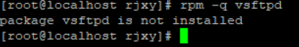
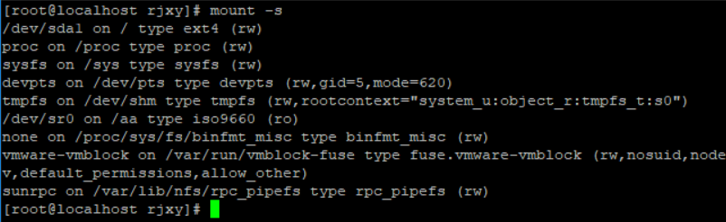
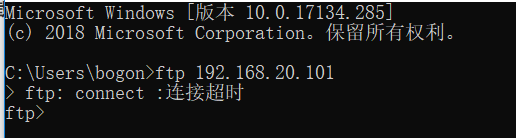
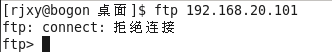

# 安装和卸载ftp服务器

```
#查看是否安装ftp服务器端
rpm -q vsftpd
```



> 查看镜像被挂载到哪里



```
#切换到镜像下的Package下：
#安装ftp服务器
rpm -ivh vsftpd-2.2.2-6.el6_0.1.i686.rpm
#开启ftp服务器
service vsftpd restart
```

> 此时windows去连失败



```
#为了排除防火墙的干扰，安装ftp客户端，进行访问本机ftp服务器
rpm -ivh ftp-0.17-51.1.el6.i686.rpm
```

> linux系统中打开ftp客户端，连接ftp服务器失败：



> 在linux防火墙中放行ftp

> 前面说过，防火墙拦截运输层


> 仍然不行，看来ftp服务器需要配置

# 服务器端vsftpd的配置

> vsftpd是ftp服务器的服务的名称。
>
> 因此，配置文件的位置在`/etc/vsftpd/vsftpd.conf`.

```
配置vsftpd服务器主要是通过对配置文件/etc/vsftpd /vsftpd.conf中选项的设定来实现。
配置文件vsftpd.conf的内容非常单纯，每一行即为一项设定。(有点像java的配置文件)
若是空白行或是开头为“#”的一行，将会被忽略。(忽略并不意味着这个选项没有，而是使用它的默认值)
对每一项的描述都是由代表该项的名称和值两部分组成，如：option=value，(key-value)
其中option代表要设定项的名称，value代表为该项所赋的值，设定时需注意等号两边不能加空格。(鉴定完毕，和JDBC.properties一样的语法)
#配置文件最好大小写分明(尊重，模仿默认配置的大小写)
#修改前对这个文件做备份
```

## vsftpd.conf 

> if 用#注释掉，则该项用默认值
>
> else 			 ,   则该项用初始值

| 参数名                                                       | 说明                                                         |
| ------------------------------------------------------------ | ------------------------------------------------------------ |
| anonymous_enable                                             | 设定是否允许匿名登入。默认值为YES；初始值为YES               |
| local_enable                                                 | 设定是否允许本机的用户登入，默认值为NO；初始值为YES          |
| local_umask                                                  | 设定本机登入者新增档案时的umask 数值，默认值为077；初始值为022 |
| write_enable                                                 | 指定是否开放写权限，默认值为NO；初始值为YES                  |
| anon_upload_enable                                           | 是否允许匿名用户上传文件，须将全局的write_enable=YES。默认为NO |
| anon_mkdir_write_enable                                      | 是否允许匿名用户创建新文件夹。默认为NO                       |
| dirmessage_enable                                            | 指定是否激活目录欢迎信息功能。如果激活，可以在目录下使用 .meaasage 文件设置欢迎信息。默认为NO；初始值为YES |
| listen=YES/NO                                                | 指定vsftpd 服务器的运行方式，如果设为YES，则以独立运作的方式运行。(脱离一些网络管理工具的管理，作为service里的一项独立的服务)默认值为NO；初始值为YES |
| data_connection_timeout                                      | 指定数据连接空闲多长时间（以秒为单位）后自动断开，默认值为300 |
| idle_session_timeout                                         | 指定用户会话空闲多次时间（以秒为单位）后自动断开，默认值为300 |
| xferlog_enable                                               | 指定是否启用日志功能，默认值为NO；初始值为YES                |
| xferlog_file                                                 | 指定日志文件所在的位置，默认取值为/var/log/xferlog           |
| userlist_enable                                              | 指定是否启用user_list 文件，默认取值为NO；初始值为YES        |
| userlist_deny                                                | 指定只有user_list 文件中的用户能/不能登录，默认取值为YES（配合上面一项的意思：if(userlist_enable==yes)）{if(userlist_deny==yes){user_list文件中的用户将被禁用ftp登陆}else{仅user_list中的用户被允许ftp登陆}}else{userlist_deny失效，也就意味着user_list文件不会被使用} |
| pam_service_name                                             | 指定验证方式，默认值为ftp；初始值为vsftpd                    |
| tcp_wrapper                                                  | 指定是否启用防火墙。默认值为NO；初始值为YES                  |
| chroot_local_user、chroot_list_enable、chroot_list_file、local_root | 配合使用，指定chroot_list_file里列出的用户能/不能切换其“根目录”。详见后面。chroot_local_user和chroot_list_enable的默认值均为NO |

```
需要掌握的是:
【anonymous_enable】(ftp是否允许匿名登陆的)、
【local_enable】(本地用户`linux`是否禁用的)、
【anon_upload_enable】、【anon_mkdir_write_enable】、【listen】、【userlist_enable&userlist_deny】(控制ftp用户登录的)、
【chroot_local_user、chroot_list_enable、chroot_list_file、local_root】(控制ftp用户切换目录的)
```

```
#行号和对应的选项(为什么给这个呢？可以看到配置文件在一个软件体系中很重要，改错软件就很容易出问题，因此有些服务项根本在设计之初就不发生变化)
12：anonymous_enable=YES	 //允许匿名访问，这是匿名服务器必需的
15：local_enable=YES
18：write_enable=YES
22：local_umask=022
35：dirmessage_enable=YES
38：xferlog_enable=YES
55：xferlog_std_format=YES
109：listen=YES
116：pam_service_name=vsftpd
117：userlist_enable=YES
118：tcp_wrappers=YES
```

## vsftpd的配置


> 最后

```
service vsftpd restart
#其他命令
##停止
service vsftpd stop
##启动
service vsftpd start
```

# 客户端ftp使用

> ftp客户端是说在命令模式下的操作。这个操作在windows的cmd下和linux下的terminal下都是一模一样的。
>
> 但如果用任何的ftp图形化工具，也可以完全可以达到同样的效果。

## ftp客户端常用命令

```
#ftp端命令
open：打开ftp服务器
pwd：显示远程目录
ls：显示远程目录的内容
!cd：查看本地当前目录（!cd是Windows的命令，如果本地是linux，则用!pwd命令）
!dir：查看本地目录的内容（!dir是Windows的命令，如果本地是linux，则用!ls命令）
cd：改变远程主机目录
lcd：改变本地主机目录
get：下载文件
put：上传文件
quit/bye：退出登录
```

## ftp的使用

```
#在windows中登录ftp服务器（假设ftp服务器地址为192.168.2.1），使用用户rjxy登录
1 ftp 192.168.2.1
#查看远程目录
2 ls	
#查看远程主机宿主目录
3 pwd	
#切换远程目录到/home
4 cd /home	
#查看是否切换成功
pwd		
#查看本地目录
5 !cd			
#切换本地目录到c:\
6 lcd c:\		
#查看是否切换成功
!cd				
#创建目录ab，提示失败，因为当前在/home目录，而rjxy用户对此目录没有写权限
7 mkdir ab		
#切换远程目录到/home/rjxy
8 cd /home/rjxy		
#在当前目录下创建目录ab
9 mkdir ab			
#把远程当前目录下的文件“a”复制到本地当前目录，并重命名为“aaa.txt”（注意，需要先在fedora中/home/rjxy目录下创建文件“a”）
10 get a aaa.txt	
#查看当前目录有没有文件“aaa.txt”
!dir				
#把本地c:\1.txt文件上传到ftp服务器当前目录，并改名为“2”（注意，需要现在c:\创建文件1.txt）
11 put c:\1.txt 2	
#查看ftp服务器当前目录是否有文件“2”
ls				
#退出ftp服务器
12 bye					
```


