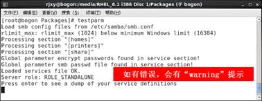

# linux配置samba服务器

## smb协议

```
在不同计算机之间共享打印机和文件的协议，用于局域网管理和windows服务器系统管理中
samba用到了spool技术(OS里面著名的spooling井技术)
smb是协议，samba是linux上实现smb协议的软件，windows上实现的软件是网上邻居，就是打开资源管理器后左边的一台台计算机。
samba的守护进程：smb,nmb
```

## smb&nmb

```
smb是Samba的核心启动服务，
- 建立smb协议软件的client,server的连接
- 验证user身份，提供对文件系统、打印机系统的访问
#只有smb服务启动，才能实现文件共享
#Port:TCP 139
```

```
nmb是Samba的核心解析服务，
- 工作组&IP对应
#如果NMB服务没有启动，则只能通过IP访问共享文件。
#Port:TCP 137&138
```

```
smb&nmb的配置文件位置
/etc/smb/smb.conf
```

## samba服务器安装

```
所需软件：
	samba（服务器端）、
	samba-common（通用工具和库文件，服务器和客户端都需要安装）、
	samba-client（客户端）
	samba-winbind (linux & windows share files middle software)
```

>  Shell

```
#查看所有已经安装的名字带有samba的软件
rpm -qa |grep samba
#该实验环境下默认除了samba其他的都安装了
rpm -ivh samba-3.5.6-86.el6.i686.rpm
rpm -qa |grep samba
```

> 和前面ftp服务器一样，samba安装完成需要配置

## samba服务器的配置

> 1. 备份配置文件

```
cp /etc/samba/smb.conf /etc/samba/smb.conf.bak
```

> 2. 修改配置文件

```
 #此配置文件中，','是特殊字符，意思是注释。
 ##需要的话去掉注释，用例子就行了。
 #共有打印机共享和文件共享
```

```
#workgroup后面要和windows的工作组一致
workgroup=WORKGROUP	74
```

```
#以用户模式登陆
##有好几种模式，1.linux本机用户&samba密码2.自己配置一台服务器，以指定的服务器为验证方式
##用的最多的还是user这种。(已经够安全)
security = user	 101
```

```
#找到下面以[public]开始的行，1.备份这些行2.取消注释
#[public]可改名，改成[myshare]
#描述
comment = share		
#共享的目录，若目录不存在，需要先创建
path = /home/share	
#不允许游客访问
public = no	
#可查看
browseable = yes	
#允许登录的用户，如果有多个用户，相互之间用逗号隔开，如果允许所有用户登录，则将该项删除
valid users =  rjxy,test	
#所有用户可写入，注意共享目录的读写权限，需要修改为其他用户具有读写权限！
writable = yes			
#允许个别用户写入，其他用户不能写入
write list = rjxy,test		
```

> 3. 注意配置文件细节

```
如果writable和write list同时存在，则以writable为准
```

> 4. 设置samba加密口令
>
> > 早期的windows版本网上邻居是没有加密的。但随着windows版本的更迭，越高的版本的windows它的samba是加密的。而linux为了适应windows,就需要对samba进行加密处理。

```
对于telnet和ftp服务器，本地用户登录时使用的是用户密码，而samba服务器不同，使用本地用户登录samba服务器时，不能使用用户密码，而需要重新设置一个samba专用的密码。
```

```
#利用/etc/passwd为samba用户创建一个单独的口令文件(批量生成)
cat /etc/passwd |mksmbpasswd.sh > /etc/samba/smbpasswd
或者更简单
touch /etc/samba/smbpasswd&cat /etc/passwd | mksmbpasswd.sh > /etc/samba/smbpasswd
```

> tips:mksmbpasswd.sh脚本安装在usr/bin目录下，可用cat查看

> 5. 在smb.conf配置文件中启用加密口令，即在/etc/samba/smb.conf配置文件中添加以下内容

```
encrypt passwords = yes
smb passwd file = /etc/samba/smbpasswd
```

> 6. 改变samba口令文件的读写权限，仅root用户才可以读写

```
chmod 600 /etc/samba/smbpasswd
```

> 7. 设置samba口令

```
#给rjxy用户设置samba口令，注意要带上参数“a”，否则提示无法设置密码
##加-a是因为第一次设置samba密码需要的 
smbpasswd -a rjxy
```

> 8. testparm  

```
#检查配置文件是否有错误
```

​           

> 9. 创建共享目录

```
mkdir /home/share
chmod 777 /home/share	
```

> 10. 关闭selinux防火墙

```
setenforce 0
```

> 11. 在“防火墙”中把samba服务放行

```
“系统”→“管理”→防火墙→可信的服务→选中Samba
```

> 12. 重启smb服务

```
service smb restart
```

> 13. 系统引导时自动激活samba服务

```
#在3级和5级运行级别自动激活smb服务
chkconfig --level 35 smb on
#查看是否激活
chkconfig --list smb
```

## windows访问

```
\\192.168.2.1
```

```
#切换用户访问samba服务器
由于windows 7系统自动记忆缓存，所以再次访问samba服务器时会自动登录，无法选择用户，需要用net use命令清除缓存
#查看缓存
net use		
#清除缓存
net use \\192.168.2.1\IPC$  /d	
```

