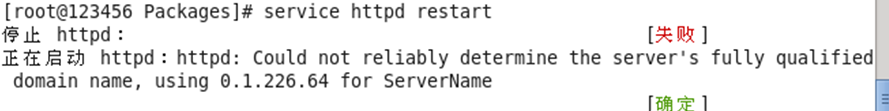
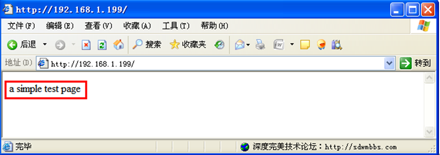
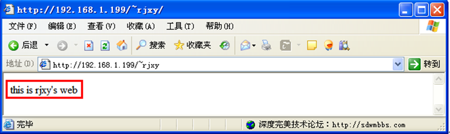
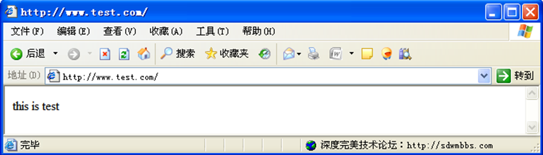
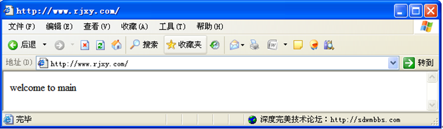

# linux配置Apache服务器

## 1.安装

```
#查看是否已经安装httpd，默认已装
rpm -qa |grep httpd
```

```
#进入光驱
cd /media/RHEL_6.1\ I386\ Disc\ 1/Packages
ls |grep httpd
rpm -ivh httpd-2.2.15-9.el6.i686.rpm
```

## 2.配置通网络

> 略

## 3.重启httpd服务

```
#启动httpd服务
service httpd restart
```

> 重启httpd服务时可能有如下警示



```
①	编辑httpd.conf配置文件，找到第276行“ServerName www.example.com:80”，在下一行添加“ServerName localhost:80”
②	重启httpd服务：service httpd restart
2)	关闭selinux防火墙
   setenforce 0
3)	在“系统”→“管理”→“防火墙”中，将“WWW（http）——80/tcp”服务放行
4)	系统引导时自动激活httpd服务
chkconfig --level 35 httpd on	#在3级和5级运行级别自动激活httpd服务
chkconfig --list httpd			#查看是否激活
```

## 4.简单服务测试

```
通常情况下，网站主页需要放置在Apache的文档目录（DocumentRoot）中才可以发布在网页当中，默认的路径是“/var/www/html”目录，即只要将网站主页放在“/var/www/html”目录下，即可访问主页。
```

```
①	在/var/www/html中建立测试网页
     echo ＂a simple test page＂>> index.html
②	设置网络，使虚拟机中的linux操作系统和实体机的windows操作系统可以相互通信（可以相互ping通）
③	在windows中使用浏览器访问“http://192.168.1.199”
【注意】这里“192.168.1.199”是虚拟机的IP地址。在同学们自己操作的时候请改成自己虚拟机的IP地址。
```



## Apache配置

### 1.用户个人主页

```
现在许多网站都允许用户拥有自己的主页空间，客户端在浏览器中浏览个人主页的 URL 地址格式一般为：http://域名/~username ，其中，“~username”在利用 Linux 系统中的 Apache服务器来实现时，是 Linux 系统的合法用户名（该用户必须在 Linux 系统中存在）。
如果要为系统中的rjxy用户设置个人主页，该用户的家目录为/home/rjxy ，个人主页空间所在的目录为 public_html ，则需要以下步骤。
①	vim /etc/httpd/conf/httpd.conf 修改第360行的相关项
  <IfModule mod_userdir.c> 
     #UserDir  Disable 						#把该项注释掉
   UserDir  public_html 					#让该项生效
 </IfModule >
将<Directory /home/*/public_html>****</Directory>之间内容的注释去掉，使之生效（第382行到第393行）
②	修改用户的家目录权限，使其他用户具有读和执行的权限
 chmod 705 –R /home/rjxy
③	创建存放用户个人主页空间的目录
 mkdir /home/rjxy/public_html
④	创建个人主页空间的默认首页文件。 
 cd /home/rjxy/public_html 
 echo “this is rjxy's web”>>index.html
⑤	重新启动 httpd服务
  service  httpd  restart 
⑥	测试
 在windows的浏览器中输入http://192.168.1.100/~rjxy
```



### 2.虚拟主机

```
虚拟主机是指在一台 Web 服务器上，通过多个独立的 IP 地址、域名或端口提供不同的Web 站点。
假如我们现在 Web 服务器域名为www.rjxy.com，IP 地址为 192.168.1.199，现决定添加一个 Web 站点 www.test.com，通过虚拟主机实现该功能。下面我们用基于域名的方法予以实现，基于IP的方法和基于端口的方法留给有兴趣的同学自学。
①	基于域名的虚拟主机 
基于域名的虚拟主机，服务器有一个 IP 地址即可，所有的虚拟主机共享同一个IP，各虚拟主机之间通过域名进行区分。设置过程如下：
1)	编辑httpd.conf配置文件，找到第991行“NameVirtualHost *:80”，在下一行添加“NameVirtualHost 192.168.1.199”
再添加如下信息：
<VirtualHost 192.168.1.199>
DocumentRoot  /var/www/html
ServerName   www.rjxy.com
</VirtualHost>  
<VirtualHost 192.168.1.199>  
DocumentRoot  /var/www/test
ServerName   www.test.com 
</VirtualHost>  
2)	创建目录及首页文件、 修改访问权限
mkdir  /var/www/test
echo “this is test”>/var/www/test/index.html
echo  “Welcome  to  main”>/var/www/html/index.html
3)	服务重启
service  httpd  restart
4)	修改windows的hosts文件（该文件为域名解析文件，和DNS配合使用）
在windows的C:\WINDOWS\system32\drivers\etc\hosts中添加如下内容：
192.168.1.199  www.rjxy.com
192.168.1.199  www.test.com
192.168.1.199  http://www.rjxy.com
192.168.1.199  http://www.test.com
5)	测试连接
```





```
【以下内容供有兴趣的同学自学】
②	基于 IP 地址的虚拟主机
基于 IP 地址的虚拟主机是在服务器上绑定多个 IP 地址，然后配置 Apache，把多个网站绑定在不同的 IP 地址上，访问服务器上不同的 IP 地址，用户可以访问不同的网站。具体实现步骤如下：
1）为网卡设置多个 IP 地址
ifconfig eth0:0 192.168.1.10  netmask 255.255.255.0 
2）使用 Vi 编辑器修改配置文件 httpd.conf
vim /etc/httpd/conf/httpd.conf
添加：
<VirtualHost 192.168.1.100>  
DocumentRoot  /var/www/html 
ServerName   www.rjxy.com 
</VirtualHost>  
<VirtualHost 192.168.1.10>  
DocumentRoot  /var/www/bbs.rjxy.com 
ServerName   bbs.rjxy.com 
</VirtualHost>  
3）创建目录及首页文件
mkdir  /var/www/bbs.rjxy.com 
echo “Welcome  to  bbs”>/var/www/bbs.rjxy.com/
echo  “Welcome  to  main”>/var/www/html
4）修改访问权限
chmod  -R 755  /var/www/bbs.rjxy.com 
5）重启服务
service  httpd  restart
6）测试
首先配置好DNS，在windows的C:\WINDOWS\system32\drivers\etc\hosts中添加两行：
192.168.1.100 www.rjxy.com
192.168.1.10  bbs.rjxy.com
在浏览器的地址栏中分别输入http://www.rjxy.com  http://bbs.rjxy.com

③	基于端口号的虚拟主机 
服务器只需有一个 IP 地址即可，所有的虚拟主机共享同一个IP ，各虚拟主机之间通过不同的端口号进行区分。实现步骤如下：
1）使用 Vi 编辑器修改配置文件 httpd.conf
vim /etc/httpd/conf/httpd.conf
注释NameVirtualHost
注释第136行： Listen 80
添加：
listen 192.168.1.100:80
listen 192.168.1.100:8080
<VirtualHost 192.168.1.100:80>  
DocumentRoot  /var/www/html 
ServerName   www.rjxy.com
</VirtualHost>  
<VirtualHost 192.168.1.100:8080>  
DocumentRoot  /var/www/bbs.rjxy.com 
ServerName   www.rjxy.com
</VirtualHost>
2）创建目录及首页文件、 修改访问权限
此步骤工作在基于 IP 地址的虚拟主机的例子中已完成，可直接继续
3）服务重启
service  httpd  restart
4）测试
http://192.168.1.100:80  http://192.168.1.100:8080

3. 虚拟目录
通常情况下，网站资源需要放置在Apache 的文档目录（DocumentRoot）中才可以发布在网页当中，默认的路径是“/var/www/html ”目录。如果想要发布文档目录以外的其他目录就需要用到虚拟目录功能。虚拟目录是一个位于 Apache服务器主目录之外的目录，它不包含在 Apache服务器的主目录中，但在访问 Web 站点的用户看来，它与位于主目录中的子目录是一样的。每一个虚拟目录都有一个别名，客户端可以通过此别名来访问虚拟目录。在Apache服务器的主配置文件httpd.conf中，通过 Alias指令设置虚拟目录。
如果要在该服务器上创建名为/test/ 的虚拟目录，它对应的物理路径是“/home/test/ ”，需要以下步骤的设置。
①	创建物理目录
mkdir  /home/test
②	创建默认首页文件
cd /home/test
echo “test directory!”>> index.html
③	修改目录权限
chmod 705 /home/test
④	修改配置文件
vim /etc/httpd/conf/httpd.conf
添加Alias  /test/   /home/test/ 		【注意】test后面的斜杠/不能少！！
⑤	重启服务
service  httpd  restart
⑥	测试 在windows的浏览器中输入地址http://192.168.1.100/test/
【提醒】结尾的/不能省

4. 访问控制
在Apache服务器的主配置文件 httpd.conf中有很多目录容器，可以通过设置服务器上某个目录的权限，对用户的访问进行控制。
如果我们想要对/test 虚拟目录进行保护，只有输入合法的用户名和密码才能访问该目录，需要做以下设置。
①修改主配置文件 httpd.conf，添加<Directory “/home/test/”> 容器的内容。
vim /etc/httpd/conf/httpd.conf
添加
<Directory  "/home/test/"> 
options   indexes 
Allowoverride  none 
AuthName   “Test directory is protected!!” 
AuthType  Basic 
AuthUserFile  /var/www/htpasswdfile 
Require valid-user 
</Directory> 
②利用 htpasswd 命令生成用户密码文件，并为rjxy用户设置登录密码。 
 htpasswd –c /var/www/htpasswdfile rjxy
③重启服务
 service  httpd  restart
```

